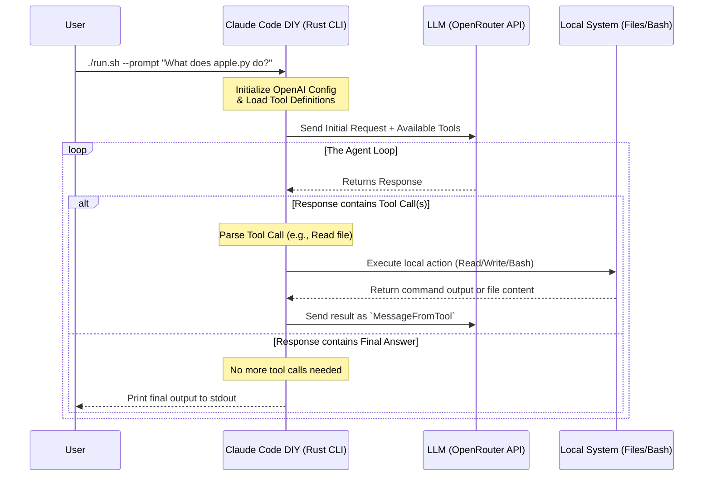

You can find the full code for this project on GitHub: [github.com/frchandra/claude-code-diy](github.com/frchandra/claude-code-diy).

## Background

Have you ever wondered how AI-powered developer tools like Claude Code or GitHub Copilot CLI actually work under the hood? It turns out, building your own terminal-based AI agent that can read files, write code, and execute bash commands is entirely possible.

In this post, we'll dive deep into the **Claude Code DIY** project—a Rust-based implementation that demystifies the magic of AI agents. We'll explore its architecture, understand its tool-calling mechanism, and see how it orchestrates the agent loop to autonomously solve tasks.

---

## Architecture & The Agent Loop

At the heart of any AI agent is the **Agent Loop**. An LLM by itself cannot access your local filesystem or execute terminal commands. To bridge this gap, the agent operates in a continuous loop: reasoning about the problem, requesting a tool invocation, waiting for the results, and reasoning again.

Here is a visual representation of how Claude Code DIY handles a user's prompt:



### The 4-Step Agent Workflow
1. **Communicate:** The CLI receives a prompt and sends it to an OpenAI-compatible API (via OpenRouter).
2. **Advertise Tools:** The request includes JSON schemas describing available tools (`Read`, `Write`, `Bash`).
3. **Execute Tools:** When the LLM decides it needs information, it replies with a `tool_call`. The Rust program intercepts this, extracts the arguments, and executes the local system operation.
4. **Iterate:** The result of the local operation is sent back to the LLM. This loop continues until the LLM has enough context to provide a final text response.

---

## Technology Stack

The project relies on a robust and modern Rust ecosystem to handle asynchronous tasks, API communication, and CLI arguments:

- **Rust:** The core programming language, chosen for its safety, performance, and excellent CLI ecosystem.
- **Tokio:** The asynchronous runtime powering the application, allowing non-blocking file operations and API requests.
- **async-openai:** Used to format requests and handle responses. By leveraging the `byot` (Bring Your Own Type) feature, the project defines its own strict schemas while using the library's networking backbone.
- **Serde & Serde JSON:** Critical for serializing tool schemas and deserializing the LLM's dynamic JSON responses.
- **Clap:** A powerful command-line argument parser used to gracefully handle the `--prompt` (`-p`) inputs.

---

## Key Features & Capabilities

By implementing localized tool execution, Claude Code DIY equips the LLM with three primary superpowers:

1. **File Reading (`Read` Tool):** 
   The agent can explore the codebase by requesting the contents of specific files.
2. **File Writing (`Write` Tool):** 
   The agent can autonomously author new code, modify configuration files, or generate Markdown based on the user's prompt.
3. **Bash Execution (`Bash` Tool):**
   The most powerful feature—the agent can run arbitrary shell commands. It can list directories, delete old files, or check system configurations.

---

## Project Structure Walkthrough

Let's look at how the repository is structured to enable this functionality.

```text
claude-code-diy/
├── Cargo.toml          # Rust dependencies and project metadata
├── run.sh              # Shell script for localized, isolated compilation & execution
├── readme.md           # Progressive tutorial on building the agent
└── src/
    ├── main.rs         # The agent loop, tool execution logic, and CLI entry point
    └── schema.rs       # Serde structs defining the OpenAI tool specifications
```

### `src/schema.rs`: Defining the Boundaries
This file is a masterclass in JSON schema definition in Rust. It defines exactly how the agent communicates its capabilities to the LLM. Using strictly typed structs (`ToolSpec`, `FunctionSpec`, `PropertiesSpec`), it ensures that the LLM knows exactly what parameters are required to trigger a `Read`, `Write`, or `Bash` command.

### `src/main.rs`: The Engine
The `main.rs` file contains the `execute_tool` asynchronous function, which pattern-matches on the LLM's requested function name:
- If `"Read"`, it uses `tokio::fs::read_to_string`.
- If `"Write"`, it uses `tokio::fs::write`.
- If `"Bash"`, it spawns a native `std::process::Command` executing `"sh -lc"`.

The `loop { ... }` block inside the `main` function is the literal representation of the Agent Loop. It continuously fetches responses, appends tool results to the conversation history, and breaks only when the `tool_calls` array is empty.

---

## How to Run It

To experience the agent firsthand, you need an OpenRouter account to interface with models like Anthropic's Claude.

**1. Set your Environment Variables:**
```bash
export OPENROUTER_API_KEY="your-api-key-here"
```

**2. Execute a Prompt:**
Use the provided bash script to compile and run the CLI securely. Let's ask it to perform a complex, multi-step task:

```bash
./run.sh --prompt "List project files using ls, then read Cargo.toml and summarize its dependencies."
```

Behind the scenes, the agent will:
1. Formulate a plan.
2. Call the `Bash` tool with `ls`.
3. Receive the directory listing.
4. Call the `Read` tool for `Cargo.toml`.
5. Provide a final generated summary directly to your terminal.


