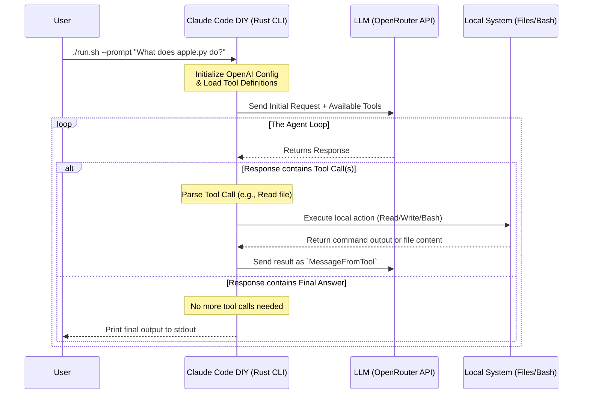

## Latar Belakang

Pernahkah Anda bertanya-tanya bagaimana developer tools bertenaga AI seperti Claude Code atau GitHub Copilot CLI sebenarnya bekerja di balik layar? Ternyata, membangun AI agent berbasis terminal Anda sendiri yang dapat membaca file, menulis kode, dan menjalankan perintah bash sepenuhnya memungkinkan.

Dalam post ini, kita akan menyelami proyek **Claude Code DIY**—implementasi berbasis Rust yang mengungkap keajaiban AI agents. Kita akan mengeksplorasi arsitekturnya, memahami mekanisme tool-calling-nya, dan melihat bagaimana ia mengorkestrasi agent loop untuk menyelesaikan tugas secara otonom.

---

## Arsitektur & Agent Loop

Inti dari setiap AI agent adalah **Agent Loop**. LLM dengan sendirinya tidak dapat mengakses filesystem lokal Anda atau menjalankan perintah terminal. Untuk menjembatani kesenjangan ini, agent beroperasi dalam loop berkelanjutan: bernalar tentang masalah, meminta invokasi tool, menunggu hasil, dan bernalar lagi.

Berikut adalah representasi visual tentang bagaimana Claude Code DIY menangani prompt pengguna:



### Workflow Agent 4 Langkah
1. **Communicate:** CLI menerima prompt dan mengirimnya ke API yang kompatibel dengan OpenAI (melalui OpenRouter).
2. **Advertise Tools:** Request mencakup skema JSON yang mendeskripsikan tools yang tersedia (`Read`, `Write`, `Bash`).
3. **Execute Tools:** Ketika LLM memutuskan ia membutuhkan informasi, ia membalas dengan `tool_call`. Program Rust menangkap ini, mengekstrak argumen, dan menjalankan operasi sistem lokal.
4. **Iterate:** Hasil dari operasi lokal dikirim kembali ke LLM. Loop ini berlanjut sampai LLM memiliki cukup konteks untuk memberikan respons teks final.

---

## Technology Stack

Proyek ini mengandalkan ekosistem Rust yang robust dan modern untuk menangani tugas asynchronous, komunikasi API, dan argumen CLI:

- **Rust:** Bahasa pemrograman inti, dipilih karena keamanan, performa, dan ekosistem CLI yang sangat baik.
- **Tokio:** Runtime asynchronous yang menjalankan aplikasi, memungkinkan operasi file non-blocking dan request API.
- **async-openai:** Digunakan untuk memformat request dan menangani response. Dengan memanfaatkan fitur `byot` (Bring Your Own Type), proyek ini mendefinisikan skema strict-nya sendiri sambil menggunakan backbone networking library.
- **Serde & Serde JSON:** Kritis untuk serialisasi skema tool dan deserialisasi response JSON dinamis dari LLM.
- **Clap:** Parser argumen command-line yang powerful yang digunakan untuk menangani input `--prompt` (`-p`) dengan baik.

---

## Fitur & Kemampuan Utama

Dengan mengimplementasikan eksekusi tool lokal, Claude Code DIY melengkapi LLM dengan tiga superpower utama:

1. **File Reading (`Read` Tool):** 
   Agent dapat mengeksplorasi codebase dengan meminta isi file tertentu.
2. **File Writing (`Write` Tool):** 
   Agent dapat secara otonom menulis kode baru, memodifikasi file konfigurasi, atau menghasilkan Markdown berdasarkan prompt pengguna.
3. **Bash Execution (`Bash` Tool):**
   Fitur paling powerful—agent dapat menjalankan perintah shell arbitrary. Ia dapat membuat daftar direktori, menghapus file lama, atau memeriksa konfigurasi sistem.

---

## Walkthrough Struktur Proyek

Mari kita lihat bagaimana repository distrukturkan untuk mengaktifkan fungsionalitas ini.

```text
claude-code-diy/
├── Cargo.toml          # Dependensi Rust dan metadata proyek
├── run.sh              # Shell script untuk kompilasi & eksekusi lokal yang terisolasi
├── readme.md           # Tutorial progresif tentang membangun agent
└── src/
    ├── main.rs         # Agent loop, logika eksekusi tool, dan entry point CLI
    └── schema.rs       # Struct Serde yang mendefinisikan spesifikasi tool OpenAI
```

### `src/schema.rs`: Mendefinisikan Batasan
File ini adalah masterclass dalam definisi skema JSON di Rust. Ini mendefinisikan dengan tepat bagaimana agent mengkomunikasikan kemampuannya ke LLM. Menggunakan struct yang strictly typed (`ToolSpec`, `FunctionSpec`, `PropertiesSpec`), ia memastikan bahwa LLM tahu persis parameter apa yang diperlukan untuk memicu perintah `Read`, `Write`, atau `Bash`.

### `src/main.rs`: Mesin
File `main.rs` berisi fungsi asynchronous `execute_tool`, yang melakukan pattern-matching pada nama fungsi yang diminta LLM:
- Jika `"Read"`, ia menggunakan `tokio::fs::read_to_string`.
- Jika `"Write"`, ia menggunakan `tokio::fs::write`.
- Jika `"Bash"`, ia spawn `std::process::Command` native yang menjalankan `"sh -lc"`.

Blok `loop { ... }` di dalam fungsi `main` adalah representasi literal dari Agent Loop. Ini terus-menerus mengambil response, menambahkan hasil tool ke history percakapan, dan break hanya ketika array `tool_calls` kosong.

---

## Cara Menjalankannya

Untuk merasakan agent secara langsung, Anda memerlukan akun OpenRouter untuk berinteraksi dengan model seperti Claude dari Anthropic.

**1. Set Environment Variables Anda:**
```bash
export OPENROUTER_API_KEY="your-api-key-here"
```

**2. Jalankan Prompt:**
Gunakan bash script yang disediakan untuk mengkompilasi dan menjalankan CLI dengan aman. Mari kita minta untuk melakukan tugas kompleks multi-step:

```bash
./run.sh --prompt "List project files using ls, then read Cargo.toml and summarize its dependencies."
```

Di balik layar, agent akan:
1. Merumuskan rencana.
2. Memanggil tool `Bash` dengan `ls`.
3. Menerima listing direktori.
4. Memanggil tool `Read` untuk `Cargo.toml`.
5. Memberikan ringkasan yang dihasilkan langsung ke terminal Anda.
