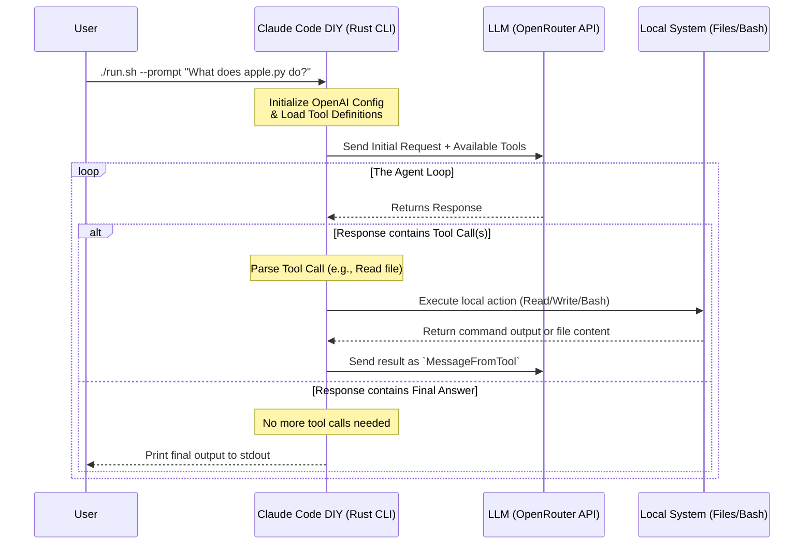

## 背景

Claude CodeやGitHub Copilot CLIのようなAI搭載の開発者ツールが実際にどのように動作しているのか、疑問に思ったことはありませんか？実は、ファイルの読み取り、コードの記述、bashコマンドの実行が可能な独自のターミナルベースAIエージェントを構築することは完全に可能です。

この投稿では、**Claude Code DIY**プロジェクトを深く掘り下げます。これはAIエージェントの魔法を解き明かすRustベースの実装です。そのアーキテクチャを探求し、ツール呼び出しメカニズムを理解し、タスクを自律的に解決するためのエージェントループのオーケストレーション方法を見ていきます。

---

## アーキテクチャとエージェントループ

すべてのAIエージェントの中心にあるのは**エージェントループ**です。LLM単体では、ローカルファイルシステムにアクセスしたり、ターミナルコマンドを実行したりすることはできません。このギャップを埋めるために、エージェントは継続的なループで動作します：問題について推論し、ツールの呼び出しを要求し、結果を待ち、再び推論します。

Claude Code DIYがユーザーのプロンプトをどのように処理するかを視覚的に表現したものがこちらです：



### 4ステップエージェントワークフロー
1. **通信:** CLIはプロンプトを受け取り、OpenAI互換API（OpenRouter経由）に送信します。
2. **ツールの通知:** リクエストには、利用可能なツール（`Read`、`Write`、`Bash`）を説明するJSONスキーマが含まれます。
3. **ツールの実行:** LLMが情報が必要だと判断すると、`tool_call`で応答します。Rustプログラムはこれをインターセプトし、引数を抽出し、ローカルシステム操作を実行します。
4. **反復:** ローカル操作の結果がLLMに送り返されます。このループは、LLMが最終的なテキスト応答を提供するのに十分なコンテキストを得るまで続きます。

---

## テクノロジースタック

このプロジェクトは、非同期タスク、API通信、CLI引数を処理するために、堅牢で最新のRustエコシステムに依存しています：

- **Rust:** コアプログラミング言語。安全性、パフォーマンス、優れたCLIエコシステムのために選択されました。
- **Tokio:** アプリケーションを動かす非同期ランタイム。ノンブロッキングファイル操作とAPIリクエストを可能にします。
- **async-openai:** リクエストのフォーマットとレスポンスの処理に使用されます。`byot`（Bring Your Own Type）機能を活用することで、ライブラリのネットワーキングバックボーンを使用しながら独自の厳密なスキーマを定義します。
- **Serde & Serde JSON:** ツールスキーマのシリアライズとLLMの動的JSON応答のデシリアライズに不可欠です。
- **Clap:** `--prompt`（`-p`）入力を適切に処理するために使用される強力なコマンドライン引数パーサー。

---

## 主要な機能と能力

ローカルツール実行を実装することで、Claude Code DIYはLLMに3つの主要なスーパーパワーを装備します：

1. **ファイル読み取り（`Read`ツール）:** 
   エージェントは特定のファイルの内容を要求することで、コードベースを探索できます。
2. **ファイル書き込み（`Write`ツール）:** 
   エージェントは、ユーザーのプロンプトに基づいて、新しいコードを自律的に作成したり、設定ファイルを変更したり、Markdownを生成したりできます。
3. **Bash実行（`Bash`ツール）:**
   最も強力な機能—エージェントは任意のシェルコマンドを実行できます。ディレクトリのリスト表示、古いファイルの削除、システム構成の確認が可能です。

---

## プロジェクト構造のウォークスルー

この機能を有効にするために、リポジトリがどのように構造化されているかを見てみましょう。

```text
claude-code-diy/
├── Cargo.toml          # Rust依存関係とプロジェクトメタデータ
├── run.sh              # ローカルで隔離されたコンパイルと実行のためのシェルスクリプト
├── readme.md           # エージェント構築に関する段階的なチュートリアル
└── src/
    ├── main.rs         # エージェントループ、ツール実行ロジック、CLIエントリーポイント
    └── schema.rs       # OpenAIツール仕様を定義するSerde構造体
```

### `src/schema.rs`: 境界の定義
このファイルは、RustでのJSONスキーマ定義のマスタークラスです。エージェントがLLMにその能力をどのように伝えるかを正確に定義します。厳密に型付けされた構造体（`ToolSpec`、`FunctionSpec`、`PropertiesSpec`）を使用することで、LLMが`Read`、`Write`、または`Bash`コマンドをトリガーするために必要なパラメータを正確に知ることができます。

### `src/main.rs`: エンジン
`main.rs`ファイルには`execute_tool`非同期関数が含まれており、LLMが要求した関数名でパターンマッチングを行います：
- `"Read"`の場合、`tokio::fs::read_to_string`を使用します。
- `"Write"`の場合、`tokio::fs::write`を使用します。
- `"Bash"`の場合、`"sh -lc"`を実行するネイティブ`std::process::Command`をスポーンします。

`main`関数内の`loop { ... }`ブロックは、エージェントループの文字通りの表現です。これは継続的にレスポンスを取得し、ツール結果を会話履歴に追加し、`tool_calls`配列が空になった場合にのみブレークします。

---

## 実行方法

エージェントを直接体験するには、AnthropicのClaudeのようなモデルとインターフェースするためのOpenRouterアカウントが必要です。

**1. 環境変数を設定:**
```bash
export OPENROUTER_API_KEY="your-api-key-here"
```

**2. プロンプトを実行:**
提供されているbashスクリプトを使用して、CLIを安全にコンパイルして実行します。複雑なマルチステップタスクを実行するように依頼してみましょう：

```bash
./run.sh --prompt "List project files using ls, then read Cargo.toml and summarize its dependencies."
```

舞台裏では、エージェントは以下を行います：
1. 計画を立てる。
2. `ls`で`Bash`ツールを呼び出す。
3. ディレクトリリストを受け取る。
4. `Cargo.toml`の`Read`ツールを呼び出す。
5. 生成された要約をターミナルに直接提供する。
