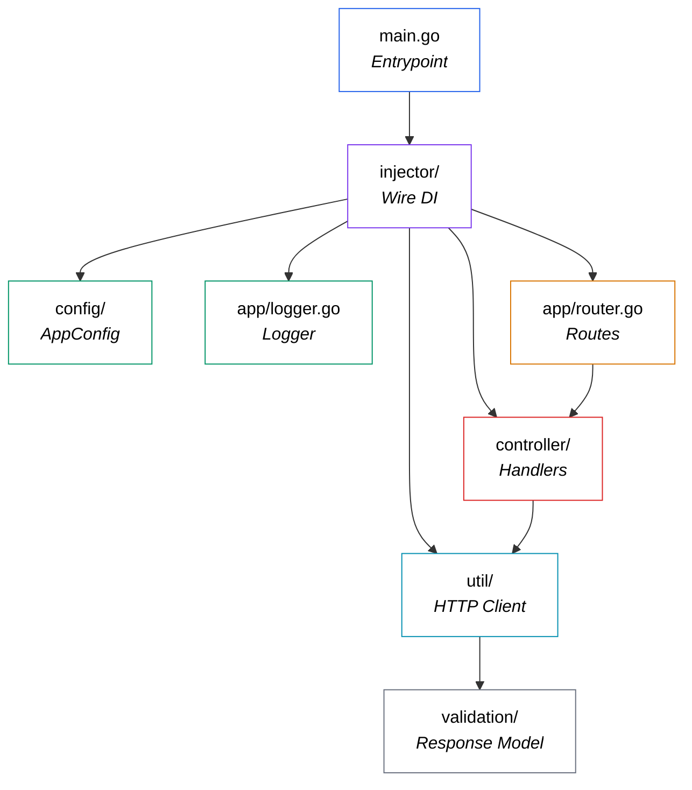

## Summary

`turnstile-validator` is a clean, well-structured Go microservice that does exactly one thing and does it well: **validates Cloudflare Turnstile tokens server-side**. It leverages idiomatic Go patterns (compile-time DI with Wire, structured logging with Logrus, clean layered architecture) and ships with Docker support for easy deployment. Whether you're integrating Turnstile into a monolith or a microservices ecosystem, this service gives you a ready-made, independently deployable validation layer.

You can find the full code for this project on GitHub: [github.com/frchandra/turnstile-validator](github.com/frchandra/turnstile-validator).


# Turnstile Validator — A Deep Dive

> **A lightweight Go microservice that acts as a server-side proxy for Cloudflare Turnstile token validation.**

---

## 1. What Is Cloudflare Turnstile?

Before we look at the code, let's understand the problem it solves.

[Cloudflare Turnstile](https://developers.cloudflare.com/turnstile/) is a **CAPTCHA alternative** that verifies whether a visitor to your website is a real human — without making them solve puzzles, identify traffic lights, or click annoying checkboxes. It runs an invisible challenge in the browser and, if the user passes, produces a **one-time token**.

But here's the catch: **the token alone means nothing**. Your backend must validate it with Cloudflare's `siteverify` API to confirm the user is legitimate. That's exactly what this service does.

### How the Turnstile Flow Works


The diagram above (from the [Cloudflare docs](https://developers.cloudflare.com/turnstile/)) illustrates the complete lifecycle:

| Step | What Happens |
|------|-------------|
| **1** | Your website loads the Turnstile script and renders the widget with your **Site Key**. |
| **2** | Cloudflare's iframe runs a challenge in the background and, on success, provides a **token** via a callback. |
| **3** | The user submits a form, and the token (`cf-turnstile-response`) is sent along to your backend. |
| **4** | Your backend (this service!) forwards the token + your **Secret Key** to `challenges.cloudflare.com/turnstile/v0/siteverify`. |
| **5** | Cloudflare verifies the token and responds with `success: true/false`. |

> [!IMPORTANT]
> The Secret Key should **never** be exposed to the client. That's why server-side validation is mandatory.

---

## 2. What Does This Service Do?

`turnstile-validator` is a **focused, single-purpose microservice**. It exposes one meaningful endpoint:

```
POST /api/v1/siteverify
```

Your frontend (or another backend service) sends the Turnstile token here, and the service:

1. **Extracts** the `cf-turnstile-response` from the multipart form body.
2. **Forwards** it — together with your Cloudflare Secret Key and the client's IP — to Cloudflare's `siteverify` API.
3. **Parses** Cloudflare's JSON response.
4. **Returns** a clean `validated: true/false` result to the caller.

It also has a health-check endpoint at `GET /` and `GET /api/v1` that returns basic service info (name, URL, timestamp).

---

## 3. Project Structure

Here's the full directory tree:

```
turnstile-validator/
├── cmd/
│   └── app/
│       └── main.go              ← Application entrypoint
├── config/
│   └── app_config.go            ← Environment & config loader
├── app/
│   ├── router.go                ← HTTP route definitions
│   ├── logger.go                ← Logrus logger factory
│   ├── controller/
│   │   ├── home_controller.go   ← Health-check handler
│   │   └── turnstile_controller.go ← Siteverify handler
│   ├── util/
│   │   └── turnstile_util.go    ← HTTP client to Cloudflare
│   └── validation/
│       └── turnstile_response.go ← Response struct/model
├── injector/
│   ├── injector.go              ← Wire DI definitions
│   └── wire_gen.go              ← Auto-generated DI wiring
├── Dockerfile                   ← Multi-stage Docker build
├── docker-compose.yml           ← Compose orchestration
├── .env.example                 ← Environment template
├── go.mod                       ← Go module & dependencies
└── go.sum                       ← Dependency checksums
```

### Architecture at a Glance

The codebase follows a **layered architecture** with clean separation of concerns:



| Layer | Package | Responsibility |
|-------|---------|----------------|
| **Entrypoint** | `cmd/app` | Bootstraps config, sets Gin mode, starts the server. |
| **Config** | `config` | Loads env vars from `.env` or system environment. |
| **Dependency Injection** | `injector` | Uses Google Wire to wire everything together at compile time. |
| **Routing** | `app` | Defines HTTP routes and maps them to controllers. |
| **Controllers** | `app/controller` | HTTP handlers — parse requests, call utilities, return responses. |
| **Utilities** | `app/util` | The actual HTTP client that talks to Cloudflare's API. |
| **Validation Models** | `app/validation` | Go structs that map to Cloudflare's JSON response. |
| **Logging** | `app` | Configures structured JSON logging with Logrus. |

---

## 4. The Tech Inside

### 4.1 Go (Golang) 1.19

The entire service is written in Go. The choice makes sense for a microservice like this — it compiles to a single binary, has excellent HTTP performance, and starts instantly.

### 4.2 Gin Web Framework

[Gin](https://github.com/gin-gonic/gin) (`v1.9.0`) is the HTTP framework powering the service. It provides:

- High-performance routing
- Middleware support (logging, recovery)
- Built-in multipart form parsing
- Convenient JSON response helpers (`c.JSON()`)

The router setup in [router.go](file:///home/chandra/Workspace/clones/turnstile-validator/app/router.go) is minimal and clean:

```go
public := router.Group("api/v1")
router.GET("/", homeController.Home)          // Health check
router.GET("/api/v1", homeController.Home)    // Health check
public.POST("/siteverify", turnstileController.SiteVerifyValidation)  // The main endpoint
```

### 4.3 Google Wire — Compile-Time Dependency Injection

Instead of manually constructing objects or using a runtime DI container, this project uses [Google Wire](https://github.com/google/wire) (`v0.5.0`). Wire generates the dependency wiring code **at compile time**, resulting in zero runtime overhead.

The [injector.go](file:///home/chandra/Workspace/clones/turnstile-validator/injector/injector.go) file defines *what* to wire:

```go
func InitializeServer() *gin.Engine {
    wire.Build(
        config.NewAppConfig,
        app.NewLogger,
        UtilSet,
        HomeSet,
        TurnstileSet,
        app.NewRouter,
    )
    return nil
}
```

Then `wire` generates [wire_gen.go](file:///home/chandra/Workspace/clones/turnstile-validator/injector/wire_gen.go) with the actual construction order:

```go
func InitializeServer() *gin.Engine {
    appConfig := config.NewAppConfig()
    logger := app.NewLogger(appConfig)
    turnstileUtil := util.NewTurnstileUtil(appConfig, logger)
    turnstileController := controller.NewTurnstileController(appConfig, logger, turnstileUtil)
    homeController := controller.NewHomeController(appConfig)
    engine := app.NewRouter(appConfig, turnstileController, homeController)
    return engine
}
```

> [!TIP]
> Wire analyzes function signatures to determine the dependency graph automatically. You declare the providers, and Wire figures out the order.

### 4.4 Logrus — Structured Logging

[Logrus](https://github.com/sirupsen/logrus) (`v1.9.0`) provides structured JSON logging. The logger's behavior changes based on environment:

| Environment | Format | Level | Caller Info |
|------------|--------|-------|-------------|
| **Development** | JSON with file:line | `Trace` (verbose) | ✅ Enabled |
| **Production** | JSON | `Info` | ❌ Disabled |

### 4.5 godotenv — Environment Configuration

[godotenv](https://github.com/joho/godotenv) (`v1.5.1`) loads variables from a `.env` file. The config loader in [app_config.go](file:///home/chandra/Workspace/clones/turnstile-validator/config/app_config.go) follows a smart fallback strategy:

```
System env var → .env file → hardcoded default
```

The environment variables you need to configure:

| Variable | Purpose | Example |
|----------|---------|---------|
| `APP_NAME` | Service identifier | `turnstile-validator` |
| `IS_PRODUCTION` | Toggles debug/release mode | `0` or `1` |
| `APP_URL` | Base URL of the service | `http://127.0.0.1` |
| `APP_PORT` | Port the server listens on | `8080` |
| `TURNSTILE_URL` | Cloudflare siteverify endpoint | `https://challenges.cloudflare.com/turnstile/v0/siteverify` |
| `TURNSTILE_SITE_KEY` | Your Turnstile Site Key | `0x...` |
| `TURNSTILE_SECRET_KEY` | Your Turnstile Secret Key | `0x...` |

### 4.6 Docker — Multi-Stage Build

The [Dockerfile](file:///home/chandra/Workspace/clones/turnstile-validator/Dockerfile) uses a **two-stage build** to keep the final image small:

```dockerfile
# Stage 1: Build the Go binary
FROM golang:latest AS builder
WORKDIR /go/src
COPY . .
RUN go mod download -x
RUN CGO_ENABLED=1 go build -o ./bin/app ./cmd/app/main.go

# Stage 2: Run the binary in a minimal image
FROM debian:stable-slim AS runner
WORKDIR /turnstile-validator
COPY --from=builder /go/src/bin /turnstile-validator
EXPOSE 5000
CMD ["/turnstile-validator/app"]
```

> [!NOTE]
> The builder stage uses the full Go toolchain (~1 GB), but the final `runner` image is just `debian:stable-slim` (~80 MB) with only the compiled binary.

---

## 5. How to Build and Run

### Prerequisites

- **Docker** ≥ 20.10 and **Docker Compose** ≥ 2.14 (for the containerized approach)
- **Go** ≥ 1.19 (for running locally)
- A Cloudflare account with [Turnstile configured](https://developers.cloudflare.com/turnstile/get-started/)

### Step 1: Clone & Configure

```bash
git clone https://github.com/frchandra/turnstile-validator.git
cd turnstile-validator

# Create your environment file from the template
cp .env.example .env
```

Edit `.env` with your Cloudflare credentials:

```env
APP_NAME=turnstile-validator
IS_PRODUCTION=0
APP_URL=http://127.0.0.1
APP_PORT=8080

TURNSTILE_URL=https://challenges.cloudflare.com/turnstile/v0/siteverify
TURNSTILE_SITE_KEY=0xYOUR_SITE_KEY
TURNSTILE_SECRET_KEY=0xYOUR_SECRET_KEY
```

### Step 2a: Run with Docker (Recommended)

```bash
# Build the image
docker compose build

# Start the service
docker compose up
```

The service will be available at **`http://localhost:5000`** (Docker maps host port `5000` → container port `8080`).

### Step 2b: Run Locally

```bash
# Download dependencies
go mod download

# Start the server
go run ./cmd/app/main.go
```

The service will be available at **`http://localhost:8080`**.

### Step 3: Test the Endpoints

**Health check:**

```bash
curl http://localhost:8080/
```

```json
{
  "app_name": "turnstile-validator",
  "app_url": "http://127.0.0.1",
  "message": "success",
  "time": "2026-05-16T12:00:00Z",
  "time_unix": 1778947200
}
```

**Validate a Turnstile token:**

```bash
curl -X POST http://localhost:8080/api/v1/siteverify \
  -F "cf-turnstile-response=YOUR_TOKEN_HERE"
```

Success response:
```json
{
  "message": "siteverify validation success",
  "validated": true
}
```

Failure response:
```json
{
  "message": "siteverify validation fail",
  "validated": false
}
```

> [!TIP]
> The full API documentation is also available as a [Postman Collection](https://documenter.getpostman.com/view/16816087/2s93XwzPW7).

---