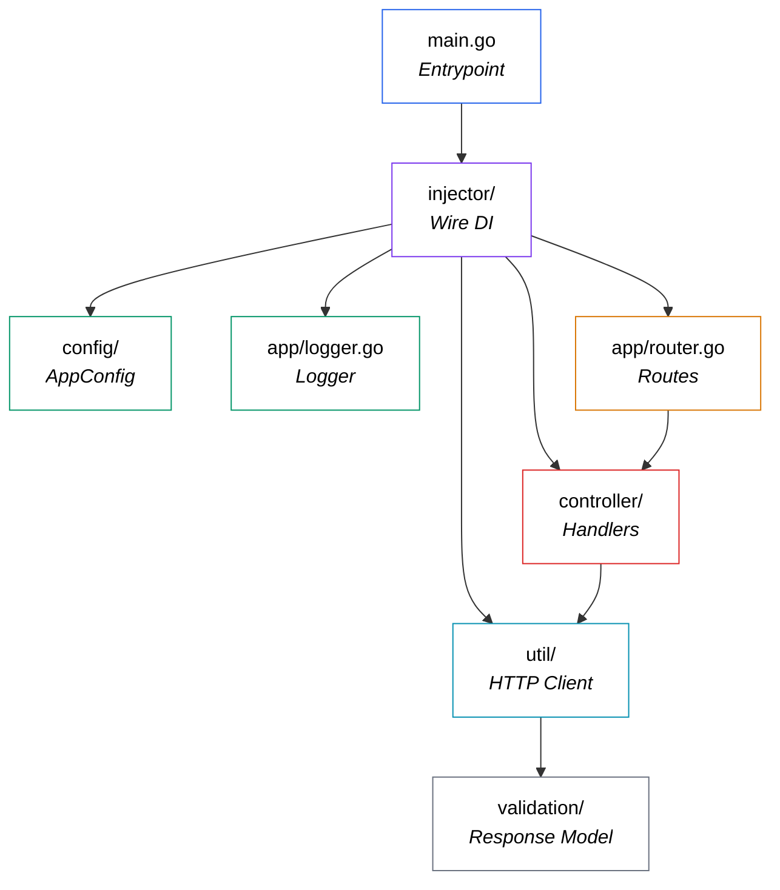

## Ringkasan

`turnstile-validator` adalah microservice Go yang bersih dan terstruktur dengan baik yang melakukan satu hal dengan sempurna: **memvalidasi token Cloudflare Turnstile di sisi server**. Memanfaatkan pola Go idiomatik (compile-time DI dengan Wire, structured logging dengan Logrus, arsitektur berlapis yang bersih) dan dilengkapi dengan dukungan Docker untuk deployment yang mudah. Baik Anda mengintegrasikan Turnstile ke dalam monolith atau ekosistem microservices, layanan ini memberi Anda layer validasi yang siap pakai dan dapat di-deploy secara independen.

Anda dapat menemukan seluruh kode untuk project ini di
GitHub: [github.com/frchandra/turnstile-validator](github.com/frchandra/turnstile-validator).

# Turnstile Validator — Deep Dive

> **Microservice Go ringan yang bertindak sebagai proxy sisi server untuk validasi token Cloudflare Turnstile.**

---

## 1. Apa Itu Cloudflare Turnstile?

Sebelum melihat kode, mari kita pahami masalah yang dipecahkannya.

[Cloudflare Turnstile](https://developers.cloudflare.com/turnstile/) adalah **alternatif CAPTCHA** yang memverifikasi apakah pengunjung website Anda adalah manusia sungguhan — tanpa membuat mereka menyelesaikan puzzle, mengidentifikasi lampu lalu lintas, atau mengklik checkbox yang mengganggu. Ini menjalankan challenge tak terlihat di browser dan, jika pengguna lulus, menghasilkan **token sekali pakai**.

Tapi inilah masalahnya: **token itu sendiri tidak berarti apa-apa**. Backend Anda harus memvalidasinya dengan API `siteverify` Cloudflare untuk mengonfirmasi bahwa pengguna tersebut sah. Itulah yang dilakukan layanan ini.

### Cara Kerja Alur Turnstile


Diagram di atas (dari [dokumentasi Cloudflare](https://developers.cloudflare.com/turnstile/)) mengilustrasikan lifecycle lengkap:

| Langkah | Yang Terjadi |
|---------|-------------|
| **1** | Website Anda memuat script Turnstile dan merender widget dengan **Site Key** Anda. |
| **2** | Iframe Cloudflare menjalankan challenge di background dan, jika berhasil, memberikan **token** melalui callback. |
| **3** | Pengguna mengirim form, dan token (`cf-turnstile-response`) dikirim bersama ke backend Anda. |
| **4** | Backend Anda (layanan ini!) meneruskan token + **Secret Key** Anda ke `challenges.cloudflare.com/turnstile/v0/siteverify`. |
| **5** | Cloudflare memverifikasi token dan merespons dengan `success: true/false`. |

> [!IMPORTANT]
> Secret Key **tidak boleh pernah** terekspos ke client. Itulah mengapa validasi di sisi server adalah wajib.

---

## 2. Apa yang Dilakukan Layanan Ini?

`turnstile-validator` adalah **microservice terfokus dengan satu tujuan**. Ini mengekspos satu endpoint yang bermakna:

```
POST /api/v1/siteverify
```

Frontend Anda (atau layanan backend lain) mengirim token Turnstile ke sini, dan layanan:

1. **Mengekstrak** `cf-turnstile-response` dari multipart form body.
2. **Meneruskan** token tersebut — bersama dengan Cloudflare Secret Key Anda dan IP client — ke API `siteverify` Cloudflare.
3. **Mem-parse** response JSON dari Cloudflare.
4. **Mengembalikan** hasil `validated: true/false` yang bersih ke pemanggil.

Ini juga memiliki endpoint health-check di `GET /` dan `GET /api/v1` yang mengembalikan info layanan dasar (nama, URL, timestamp).

---

## 3. Struktur Proyek

Berikut adalah directory tree lengkap:

```
turnstile-validator/
├── cmd/
│   └── app/
│       └── main.go              ← Entrypoint aplikasi
├── config/
│   └── app_config.go            ← Environment & config loader
├── app/
│   ├── router.go                ← Definisi route HTTP
│   ├── logger.go                ← Logger factory Logrus
│   ├── controller/
│   │   ├── home_controller.go   ← Handler health-check
│   │   └── turnstile_controller.go ← Handler siteverify
│   ├── util/
│   │   └── turnstile_util.go    ← HTTP client ke Cloudflare
│   └── validation/
│       └── turnstile_response.go ← Struct/model response
├── injector/
│   ├── injector.go              ← Definisi Wire DI
│   └── wire_gen.go              ← Wiring DI yang di-generate otomatis
├── Dockerfile                   ← Multi-stage Docker build
├── docker-compose.yml           ← Orkestrasi Compose
├── .env.example                 ← Template environment
├── go.mod                       ← Go module & dependencies
└── go.sum                       ← Dependency checksums
```

### Arsitektur Sekilas

Codebase mengikuti **arsitektur berlapis** dengan pemisahan concerns yang bersih:



| Layer | Package | Tanggung Jawab |
|-------|---------|----------------|
| **Entrypoint** | `cmd/app` | Bootstrap config, set Gin mode, start server. |
| **Config** | `config` | Load env vars dari `.env` atau system environment. |
| **Dependency Injection** | `injector` | Menggunakan Google Wire untuk meng-wire semuanya pada compile time. |
| **Routing** | `app` | Mendefinisikan HTTP routes dan memetakannya ke controller. |
| **Controllers** | `app/controller` | HTTP handlers — parse request, panggil utilities, return response. |
| **Utilities** | `app/util` | HTTP client yang sebenarnya berkomunikasi dengan API Cloudflare. |
| **Validation Models** | `app/validation` | Go structs yang memetakan response JSON Cloudflare. |
| **Logging** | `app` | Mengkonfigurasi structured JSON logging dengan Logrus. |

---

## 4. Teknologi yang Digunakan

### 4.1 Go (Golang) 1.19

Seluruh layanan ditulis dalam Go. Pilihan ini masuk akal untuk microservice seperti ini — dikompilasi menjadi single binary, memiliki performa HTTP yang excellent, dan startup instan.

### 4.2 Gin Web Framework

[Gin](https://github.com/gin-gonic/gin) (`v1.9.0`) adalah framework HTTP yang menjalankan layanan ini. Ini menyediakan:

- High-performance routing
- Dukungan middleware (logging, recovery)
- Built-in multipart form parsing
- Helper response JSON yang mudah (`c.JSON()`)

Setup router di [router.go](file:///home/chandra/Workspace/clones/turnstile-validator/app/router.go) minimal dan bersih:

```go
public := router.Group("api/v1")
router.GET("/", homeController.Home)          // Health check
router.GET("/api/v1", homeController.Home)    // Health check
public.POST("/siteverify", turnstileController.SiteVerifyValidation)  // Endpoint utama
```

### 4.3 Google Wire — Compile-Time Dependency Injection

Alih-alih membuat objek secara manual atau menggunakan runtime DI container, proyek ini menggunakan [Google Wire](https://github.com/google/wire) (`v0.5.0`). Wire meng-generate kode wiring dependency **pada compile time**, menghasilkan zero runtime overhead.

File [injector.go](file:///home/chandra/Workspace/clones/turnstile-validator/injector/injector.go) mendefinisikan *apa* yang akan di-wire:

```go
func InitializeServer() *gin.Engine {
    wire.Build(
        config.NewAppConfig,
        app.NewLogger,
        UtilSet,
        HomeSet,
        TurnstileSet,
        app.NewRouter,
    )
    return nil
}
```

Kemudian `wire` meng-generate [wire_gen.go](file:///home/chandra/Workspace/clones/turnstile-validator/injector/wire_gen.go) dengan urutan konstruksi yang sebenarnya:

```go
func InitializeServer() *gin.Engine {
    appConfig := config.NewAppConfig()
    logger := app.NewLogger(appConfig)
    turnstileUtil := util.NewTurnstileUtil(appConfig, logger)
    turnstileController := controller.NewTurnstileController(appConfig, logger, turnstileUtil)
    homeController := controller.NewHomeController(appConfig)
    engine := app.NewRouter(appConfig, turnstileController, homeController)
    return engine
}
```

> [!TIP]
> Wire menganalisis function signatures untuk menentukan dependency graph secara otomatis. Anda mendeklarasikan providers, dan Wire menentukan urutannya.

### 4.4 Logrus — Structured Logging

[Logrus](https://github.com/sirupsen/logrus) (`v1.9.0`) menyediakan structured JSON logging. Perilaku logger berubah berdasarkan environment:

| Environment | Format | Level | Caller Info |
|------------|--------|-------|-------------|
| **Development** | JSON dengan file:line | `Trace` (verbose) | ✅ Enabled |
| **Production** | JSON | `Info` | ❌ Disabled |

### 4.5 godotenv — Environment Configuration

[godotenv](https://github.com/joho/godotenv) (`v1.5.1`) memuat variabel dari file `.env`. Config loader di [app_config.go](file:///home/chandra/Workspace/clones/turnstile-validator/config/app_config.go) mengikuti strategi fallback yang cerdas:

```
System env var → .env file → hardcoded default
```

Variabel environment yang perlu Anda konfigurasi:

| Variabel | Tujuan | Contoh |
|----------|---------|---------|
| `APP_NAME` | Identifier layanan | `turnstile-validator` |
| `IS_PRODUCTION` | Toggle debug/release mode | `0` atau `1` |
| `APP_URL` | Base URL layanan | `http://127.0.0.1` |
| `APP_PORT` | Port tempat server listening | `8080` |
| `TURNSTILE_URL` | Endpoint siteverify Cloudflare | `https://challenges.cloudflare.com/turnstile/v0/siteverify` |
| `TURNSTILE_SITE_KEY` | Site Key Turnstile Anda | `0x...` |
| `TURNSTILE_SECRET_KEY` | Secret Key Turnstile Anda | `0x...` |

### 4.6 Docker — Multi-Stage Build

[Dockerfile](file:///home/chandra/Workspace/clones/turnstile-validator/Dockerfile) menggunakan **two-stage build** untuk menjaga image final tetap kecil:

```dockerfile
# Stage 1: Build binary Go
FROM golang:latest AS builder
WORKDIR /go/src
COPY . .
RUN go mod download -x
RUN CGO_ENABLED=1 go build -o ./bin/app ./cmd/app/main.go

# Stage 2: Jalankan binary dalam image minimal
FROM debian:stable-slim AS runner
WORKDIR /turnstile-validator
COPY --from=builder /go/src/bin /turnstile-validator
EXPOSE 5000
CMD ["/turnstile-validator/app"]
```

> [!NOTE]
> Builder stage menggunakan full Go toolchain (~1 GB), tetapi image `runner` final hanya `debian:stable-slim` (~80 MB) dengan hanya compiled binary.

---

## 5. Cara Build dan Run

### Prasyarat

- **Docker** ≥ 20.10 dan **Docker Compose** ≥ 2.14 (untuk pendekatan containerized)
- **Go** ≥ 1.19 (untuk menjalankan secara lokal)
- Akun Cloudflare dengan [Turnstile yang dikonfigurasi](https://developers.cloudflare.com/turnstile/get-started/)

### Langkah 1: Clone & Konfigurasi

```bash
git clone https://github.com/frchandra/turnstile-validator.git
cd turnstile-validator

# Buat file environment dari template
cp .env.example .env
```

Edit `.env` dengan kredensial Cloudflare Anda:

```env
APP_NAME=turnstile-validator
IS_PRODUCTION=0
APP_URL=http://127.0.0.1
APP_PORT=8080

TURNSTILE_URL=https://challenges.cloudflare.com/turnstile/v0/siteverify
TURNSTILE_SITE_KEY=0xYOUR_SITE_KEY
TURNSTILE_SECRET_KEY=0xYOUR_SECRET_KEY
```

### Langkah 2a: Jalankan dengan Docker (Direkomendasikan)

```bash
# Build image
docker compose build

# Mulai layanan
docker compose up
```

Layanan akan tersedia di **`http://localhost:5000`** (Docker memetakan host port `5000` → container port `8080`).

### Langkah 2b: Jalankan Secara Lokal

```bash
# Download dependencies
go mod download

# Start server
go run ./cmd/app/main.go
```

Layanan akan tersedia di **`http://localhost:8080`**.

### Langkah 3: Test Endpoints

**Health check:**

```bash
curl http://localhost:8080/
```

```json
{
  "app_name": "turnstile-validator",
  "app_url": "http://127.0.0.1",
  "message": "success",
  "time": "2026-05-16T12:00:00Z",
  "time_unix": 1778947200
}
```

**Validasi token Turnstile:**

```bash
curl -X POST http://localhost:8080/api/v1/siteverify \
  -F "cf-turnstile-response=YOUR_TOKEN_HERE"
```

Response sukses:
```json
{
  "message": "siteverify validation success",
  "validated": true
}
```

Response gagal:
```json
{
  "message": "siteverify validation fail",
  "validated": false
}
```

> [!TIP]
> Dokumentasi API lengkap juga tersedia sebagai [Postman Collection](https://documenter.getpostman.com/view/16816087/2s93XwzPW7).

---