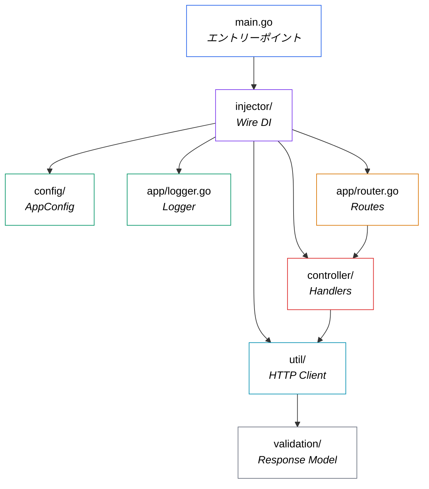

## 概要

`turnstile-validator`は、クリーンで構造化されたGoマイクロサービスで、一つのことを正確に実行します：**Cloudflare Turnstileトークンのサーバーサイド検証**。慣用的なGoパターン（Wireによるコンパイル時DI、Logrusによる構造化ログ、クリーンなレイヤードアーキテクチャ）を活用し、簡単なデプロイのためのDockerサポートを提供します。Turnstileをモノリスまたはマイクロサービスエコシステムに統合する場合でも、このサービスは既製の独立してデプロイ可能な検証レイヤーを提供します。

このプロジェクトの完全なコードはGitHubで確認できます:  [github.com/frchandra/turnstile-validator](github.com/frchandra/turnstile-validator).


# Turnstile Validator — 詳細解説

> **Cloudflare Turnstileトークン検証のためのサーバーサイドプロキシとして機能する軽量Goマイクロサービス。**

---

## 1. Cloudflare Turnstileとは？

コードを見る前に、それが解決する問題を理解しましょう。

[Cloudflare Turnstile](https://developers.cloudflare.com/turnstile/)は、Webサイトへの訪問者が本物の人間であるかを検証する**CAPTCHAの代替手段**です — パズルを解いたり、信号機を識別したり、煩わしいチェックボックスをクリックしたりする必要はありません。ブラウザで目に見えないチャレンジを実行し、ユーザーが合格すると**ワンタイムトークン**を生成します。

しかし、ここに落とし穴があります：**トークン単体では何の意味もありません**。バックエンドはCloudflareの`siteverify` APIでそれを検証し、ユーザーが正当であることを確認する必要があります。それこそがこのサービスが行うことです。

### Turnstileフローの仕組み


上記の図（[Cloudflareドキュメント](https://developers.cloudflare.com/turnstile/)より）は、完全なライフサイクルを示しています：

| ステップ | 何が起こるか |
|---------|-------------|
| **1** | WebサイトがTurnstileスクリプトを読み込み、**Site Key**を使用してウィジェットをレンダリング。 |
| **2** | Cloudflareのiframeがバックグラウンドでチャレンジを実行し、成功時にコールバックを介して**トークン**を提供。 |
| **3** | ユーザーがフォームを送信し、トークン（`cf-turnstile-response`）がバックエンドに送信される。 |
| **4** | バックエンド（このサービス！）がトークン + **Secret Key**を`challenges.cloudflare.com/turnstile/v0/siteverify`に転送。 |
| **5** | Cloudflareがトークンを検証し、`success: true/false`で応答。 |

> [!IMPORTANT]
> Secret Keyは**決して**クライアントに公開してはいけません。そのため、サーバーサイド検証は必須です。

---

## 2. このサービスは何をするのか？

`turnstile-validator`は**焦点を絞った単一目的のマイクロサービス**です。一つの重要なエンドポイントを公開します：

```
POST /api/v1/siteverify
```

フロントエンド（または他のバックエンドサービス）がTurnstileトークンをここに送信すると、サービスは：

1. マルチパートフォームボディから`cf-turnstile-response`を**抽出**。
2. Cloudflare Secret KeyとクライアントのIPと共に、それをCloudflareの`siteverify` APIに**転送**。
3. CloudflareのJSONレスポンスを**パース**。
4. 呼び出し元にクリーンな`validated: true/false`結果を**返却**。

また、`GET /`と`GET /api/v1`にヘルスチェックエンドポイントがあり、基本的なサービス情報（名前、URL、タイムスタンプ）を返します。

---

## 3. プロジェクト構造

完全なディレクトリツリーは以下の通りです：

```
turnstile-validator/
├── cmd/
│   └── app/
│       └── main.go              ← アプリケーションエントリーポイント
├── config/
│   └── app_config.go            ← 環境変数・設定ローダー
├── app/
│   ├── router.go                ← HTTPルート定義
│   ├── logger.go                ← Logrusロガーファクトリー
│   ├── controller/
│   │   ├── home_controller.go   ← ヘルスチェックハンドラ
│   │   └── turnstile_controller.go ← Siteverifyハンドラ
│   ├── util/
│   │   └── turnstile_util.go    ← CloudflareへのHTTPクライアント
│   └── validation/
│       └── turnstile_response.go ← レスポンス構造体・モデル
├── injector/
│   ├── injector.go              ← Wire DI定義
│   └── wire_gen.go              ← 自動生成されたDIワイヤリング
├── Dockerfile                   ← マルチステージDockerビルド
├── docker-compose.yml           ← Composeオーケストレーション
├── .env.example                 ← 環境変数テンプレート
├── go.mod                       ← Goモジュール・依存関係
└── go.sum                       ← 依存関係チェックサム
```

### アーキテクチャ概観

コードベースは**レイヤードアーキテクチャ**に従い、関心事の明確な分離を実現しています：



| レイヤー | パッケージ | 責任 |
|---------|---------|----------------|
| **エントリーポイント** | `cmd/app` | 設定をブートストラップし、Ginモードを設定し、サーバーを起動。 |
| **Config** | `config` | `.env`またはシステム環境変数から環境変数を読み込み。 |
| **Dependency Injection** | `injector` | Google Wireを使用してコンパイル時にすべてを配線。 |
| **Routing** | `app` | HTTPルートを定義し、コントローラーにマッピング。 |
| **Controllers** | `app/controller` | HTTPハンドラー — リクエストをパースし、ユーティリティを呼び出し、レスポンスを返却。 |
| **Utilities** | `app/util` | CloudflareのAPIと通信する実際のHTTPクライアント。 |
| **Validation Models** | `app/validation` | CloudflareのJSONレスポンスにマッピングされるGo構造体。 |
| **Logging** | `app` | Logrusによる構造化JSONロギングを設定。 |

---

## 4. 使用技術

### 4.1 Go (Golang) 1.19

サービス全体がGoで書かれています。このようなマイクロサービスにとって、この選択は理にかなっています — 単一バイナリにコンパイルされ、優れたHTTPパフォーマンスを持ち、即座に起動します。

### 4.2 Gin Webフレームワーク

[Gin](https://github.com/gin-gonic/gin) (`v1.9.0`)は、このサービスを動かすHTTPフレームワークです。以下を提供します：

- 高性能ルーティング
- ミドルウェアサポート（ロギング、リカバリ）
- 組み込みマルチパートフォームパース
- 便利なJSONレスポンスヘルパー（`c.JSON()`）

[router.go](file:///home/chandra/Workspace/clones/turnstile-validator/app/router.go)のルーター設定は最小限でクリーンです：

```go
public := router.Group("api/v1")
router.GET("/", homeController.Home)          // ヘルスチェック
router.GET("/api/v1", homeController.Home)    // ヘルスチェック
public.POST("/siteverify", turnstileController.SiteVerifyValidation)  // メインエンドポイント
```

### 4.3 Google Wire — コンパイル時依存性注入

オブジェクトを手動で構築したり、ランタイムDIコンテナを使用する代わりに、このプロジェクトは[Google Wire](https://github.com/google/wire) (`v0.5.0`)を使用します。Wireは**コンパイル時**に依存関係のワイヤリングコードを生成し、ランタイムオーバーヘッドをゼロにします。

[injector.go](file:///home/chandra/Workspace/clones/turnstile-validator/injector/injector.go)ファイルは*何を*ワイヤリングするかを定義します：

```go
func InitializeServer() *gin.Engine {
    wire.Build(
        config.NewAppConfig,
        app.NewLogger,
        UtilSet,
        HomeSet,
        TurnstileSet,
        app.NewRouter,
    )
    return nil
}
```

次に`wire`が実際の構築順序で[wire_gen.go](file:///home/chandra/Workspace/clones/turnstile-validator/injector/wire_gen.go)を生成します：

```go
func InitializeServer() *gin.Engine {
    appConfig := config.NewAppConfig()
    logger := app.NewLogger(appConfig)
    turnstileUtil := util.NewTurnstileUtil(appConfig, logger)
    turnstileController := controller.NewTurnstileController(appConfig, logger, turnstileUtil)
    homeController := controller.NewHomeController(appConfig)
    engine := app.NewRouter(appConfig, turnstileController, homeController)
    return engine
}
```

> [!TIP]
> Wireは関数シグネチャを分析して依存関係グラフを自動的に決定します。プロバイダーを宣言すれば、Wireが順序を決定します。

### 4.4 Logrus — 構造化ロギング

[Logrus](https://github.com/sirupsen/logrus) (`v1.9.0`)は構造化JSONロギングを提供します。ロガーの動作は環境に基づいて変化します：

| 環境 | フォーマット | レベル | 呼び出し元情報 |
|------------|--------|-------|-------------|
| **Development** | file:line付きJSON | `Trace`（詳細） | ✅ 有効 |
| **Production** | JSON | `Info` | ❌ 無効 |

### 4.5 godotenv — 環境設定

[godotenv](https://github.com/joho/godotenv) (`v1.5.1`)は`.env`ファイルから変数を読み込みます。[app_config.go](file:///home/chandra/Workspace/clones/turnstile-validator/config/app_config.go)の設定ローダーは、賢いフォールバック戦略に従います：

```
システム環境変数 → .envファイル → ハードコードされたデフォルト
```

設定が必要な環境変数：

| 変数 | 目的 | 例 |
|----------|---------|---------|
| `APP_NAME` | サービス識別子 | `turnstile-validator` |
| `IS_PRODUCTION` | デバッグ/リリースモード切り替え | `0`または`1` |
| `APP_URL` | サービスのベースURL | `http://127.0.0.1` |
| `APP_PORT` | サーバーがリッスンするポート | `8080` |
| `TURNSTILE_URL` | Cloudflare siteverifyエンドポイント | `https://challenges.cloudflare.com/turnstile/v0/siteverify` |
| `TURNSTILE_SITE_KEY` | Turnstile Site Key | `0x...` |
| `TURNSTILE_SECRET_KEY` | Turnstile Secret Key | `0x...` |

### 4.6 Docker — マルチステージビルド

[Dockerfile](file:///home/chandra/Workspace/clones/turnstile-validator/Dockerfile)は**2段階ビルド**を使用して最終イメージを小さく保ちます：

```dockerfile
# ステージ1: Goバイナリをビルド
FROM golang:latest AS builder
WORKDIR /go/src
COPY . .
RUN go mod download -x
RUN CGO_ENABLED=1 go build -o ./bin/app ./cmd/app/main.go

# ステージ2: 最小イメージでバイナリを実行
FROM debian:stable-slim AS runner
WORKDIR /turnstile-validator
COPY --from=builder /go/src/bin /turnstile-validator
EXPOSE 5000
CMD ["/turnstile-validator/app"]
```

> [!NOTE]
> builderステージは完全なGoツールチェーン（~1 GB）を使用しますが、最終的な`runner`イメージは`debian:stable-slim`（~80 MB）でコンパイル済みバイナリのみです。

---

## 5. ビルドと実行方法

### 前提条件

- **Docker** ≥ 20.10および**Docker Compose** ≥ 2.14（コンテナ化アプローチの場合）
- **Go** ≥ 1.19（ローカルで実行する場合）
- [Turnstileが設定された](https://developers.cloudflare.com/turnstile/get-started/)Cloudflareアカウント

### ステップ1: クローンと設定

```bash
git clone https://github.com/frchandra/turnstile-validator.git
cd turnstile-validator

# テンプレートから環境ファイルを作成
cp .env.example .env
```

Cloudflareの認証情報で`.env`を編集します：

```env
APP_NAME=turnstile-validator
IS_PRODUCTION=0
APP_URL=http://127.0.0.1
APP_PORT=8080

TURNSTILE_URL=https://challenges.cloudflare.com/turnstile/v0/siteverify
TURNSTILE_SITE_KEY=0xYOUR_SITE_KEY
TURNSTILE_SECRET_KEY=0xYOUR_SECRET_KEY
```

### ステップ2a: Dockerで実行（推奨）

```bash
# イメージをビルド
docker compose build

# サービスを起動
docker compose up
```

サービスは**`http://localhost:5000`**で利用可能になります（Dockerはホストポート`5000` → コンテナポート`8080`をマッピング）。

### ステップ2b: ローカルで実行

```bash
# 依存関係をダウンロード
go mod download

# サーバーを起動
go run ./cmd/app/main.go
```

サービスは**`http://localhost:8080`**で利用可能になります。

### ステップ3: エンドポイントをテスト

**ヘルスチェック:**

```bash
curl http://localhost:8080/
```

```json
{
  "app_name": "turnstile-validator",
  "app_url": "http://127.0.0.1",
  "message": "success",
  "time": "2026-05-16T12:00:00Z",
  "time_unix": 1778947200
}
```

**Turnstileトークンを検証:**

```bash
curl -X POST http://localhost:8080/api/v1/siteverify \
  -F "cf-turnstile-response=YOUR_TOKEN_HERE"
```

成功レスポンス:
```json
{
  "message": "siteverify validation success",
  "validated": true
}
```

失敗レスポンス:
```json
{
  "message": "siteverify validation fail",
  "validated": false
}
```

> [!TIP]
> 完全なAPIドキュメントは[Postman Collection](https://documenter.getpostman.com/view/16816087/2s93XwzPW7)としても利用可能です。

---