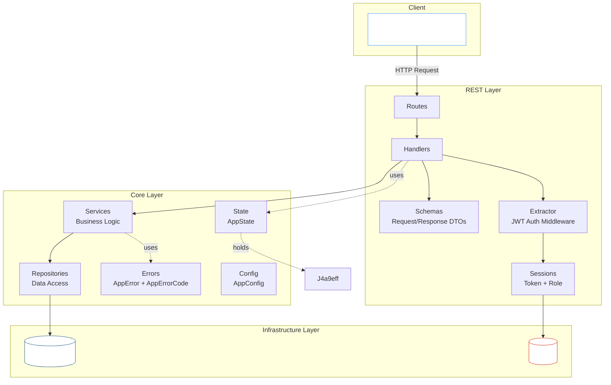
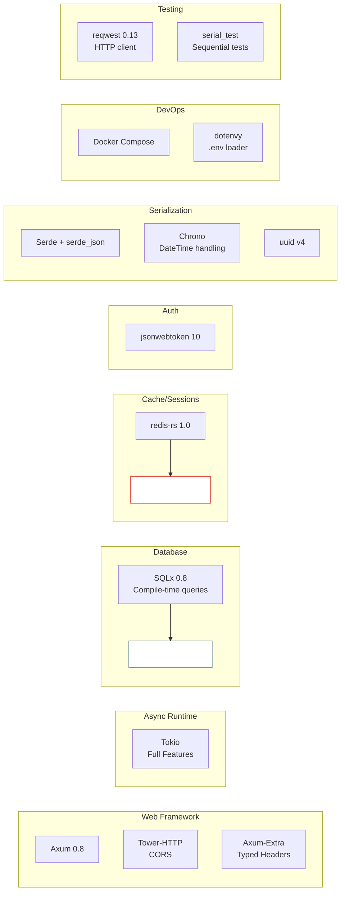
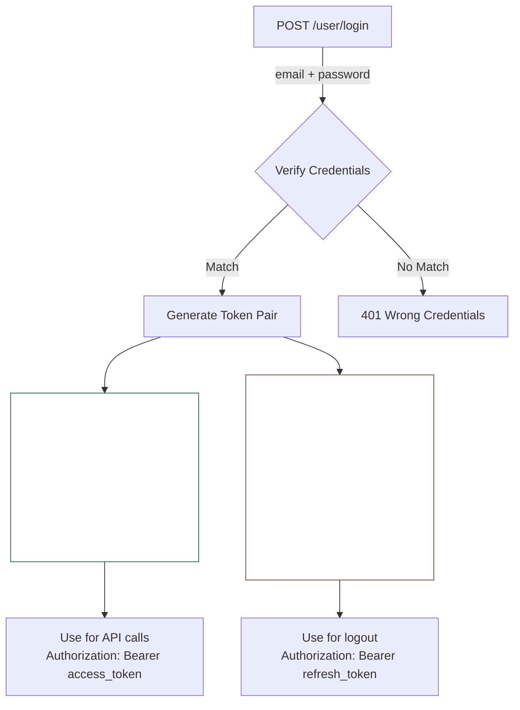

You can find the full code for this project on GitHub: [github.com/frchandra/rusty-todoish](https://github.com/frchandra/rusty-todoish).

## Features

| Capability                    | Description                                                               |
|-------------------------------|---------------------------------------------------------------------------|
| **CRUD on Notes**             | Create, Read, Update, Delete todo notes with pagination                   |
| **JWT Authentication**        | Access + Refresh token pair, signed with HS256                            |
| **Role-Based Access Control** | Three roles: `admin`, `common`, `guest` — each with different permissions |
| **Token Revocation**          | Global, per-user, and per-token revocation stored in Redis                |
| **Database Transactions**     | Atomic multi-step operations via SQLx transactions                        |
| **Graceful Shutdown**         | Handles `SIGTERM` and `Ctrl+C` cleanly                                    |
| **CORS Middleware**           | Configurable cross-origin request handling                                |
| **Integration Testing**       | Full end-to-end tests using `reqwest` against a live server               |

---

## Architecture Overview

The project follows a **layered architecture** that separates concerns cleanly. Each layer only talks to the one
directly below it — handlers never touch the database, and repositories never know about HTTP.



---

## Technology Stack



---

## Project Structure

- `src/`: Source code for the project
    - `app` : Contains the core application logic, including services and use cases.
    - `infra/`: Contains infrastructure-related code, such as database interactions and web server setup.
    - `models/`: Contains data models and DTOs (Data Transfer Objects) used across the application.
    - `domain/`: Contains the core business logic and entities of the application.
        - `postgres/`: Contains code related to PostgreSQL database interactions, including migrations and repository
          implementations.
    - `rest/`: Contains code related to the REST API, including route handlers, sessions management and request/response
      models.
    - `main.rs`: The entry point of the application, where the web server is initialized and routes are defined.
    - `lib.rs`: Entry point for the library, which can be used for testing or as a module in other projects.
- `tests/`: Contains integration tests for the application, ensuring that all components work together as expected.

---

## Feature Deep-Dives

### Authentication: JWT Access + Refresh Tokens

The authentication system uses a **dual-token strategy**:



- **Access Token** (`typ: 0`): Short-lived (1 hour default), used for all API requests.
- **Refresh Token** (`typ: 1`): Long-lived (90 days default), contains a back-reference (`prf`) to its paired access
  token. Used only for logout.

Both tokens are extracted from the `Authorization: Bearer <token>` header using Axum's custom extractor system (
`FromRequestParts`).

### Token Revocation (Three Layers)

The system supports three independent revocation strategies, all backed by Redis:

| Strategy             | Redis Key                       | Effect                                             | Who Can Trigger                       |
|----------------------|---------------------------------|----------------------------------------------------|---------------------------------------|
| **Global Revoke**    | `jwt.revoke.global.before`      | Invalidates *all* tokens issued before a timestamp | Admin only (`POST /revoke-all`)       |
| **Per-User Revoke**  | `jwt.revoke.user.before` (hash) | Invalidates all tokens for a specific user         | System / Admin                        |
| **Per-Token Revoke** | `jwt.revoked.tokens` (hash)     | Invalidates a specific token pair by JTI           | User via logout (`POST /user/logout`) |

On every request, the extractor checks all three layers before granting access.

### Database Transactions

The `add_then_update_note` endpoint demonstrates SQLx transactions:

```rust
// Simplified from notes_services.rs
let mut tx = app_state.db_pool.begin().await?;

let note = create_note(&mut *tx, title, content, is_published).await?;
let updated = update_note_by_id(&mut *tx, note.id, ...).await?;

tx.commit().await?;  // Atomic! Both succeed or both roll back.
```

The repository functions accept a generic `Executor<Database = Postgres>`, so they work equally well with a raw pool
connection or a transaction handle — no code duplication.

---

## API Endpoints Reference

### Health Check

| Method | Path | Auth | Description                      |
|--------|------|------|----------------------------------|
| `GET`  | `/`  | None | Returns service name and version |

**Response:**

```json
{
  "service_name": "rusty-todoish",
  "service_version": "0.1.0"
}
```

### Authentication

| Method | Path           | Auth                 | Description                         |
|--------|----------------|----------------------|-------------------------------------|
| `POST` | `/user/login`  | None                 | Authenticate and receive token pair |
| `POST` | `/user/logout` | Refresh Token        | Revoke the token pair               |
| `POST` | `/revoke-all`  | Access Token (Admin) | Globally revoke all tokens          |

**Login Request:**

```json
{
  "email": "admin@example.com",
  "password": "admin_password"
}
```

**Login Response:**

```json
{
  "access_token": "eyJhbGciOiJIUzI1NiIs...",
  "refresh_token": "eyJhbGciOiJIUzI1NiIs...",
  "token_type": "Bearer"
}
```

### Notes

| Method   | Path                     | Auth         | Role Required | Description                        |
|----------|--------------------------|--------------|---------------|------------------------------------|
| `GET`    | `/notes?page=1&limit=10` | Access Token | admin, common | List notes (paginated)             |
| `GET`    | `/notes/{id}`            | Access Token | admin, common | Get a single note                  |
| `POST`   | `/notes`                 | Access Token | admin         | Create a new note                  |
| `PUT`    | `/notes/{id}`            | Access Token | admin         | Update a note                      |
| `DELETE` | `/notes/{id}`            | None         | —             | Delete a note                      |
| `POST`   | `/notes/add-then-update` | None         | —             | Create + update in one transaction |

**Create Note Request:**

```json
{
  "title": "Buy groceries",
  "content": "Milk, eggs, bread",
  "is_published": true
}
```

**Note Response:**

```json
{
  "id": "a1b2c3d4-e5f6-7890-abcd-ef1234567890",
  "title": "Buy groceries",
  "content": "Milk, eggs, bread",
  "is_published": true,
  "created_at": "2026-03-15T10:30:00Z",
  "updated_at": "2026-03-15T10:30:00Z"
}
```

**Update Note Request** (all fields optional):

```json
{
  "title": "Buy groceries (updated)",
  "content": "Milk, eggs, bread, cheese",
  "is_published": false
}
```

---

## Error Handling

Every error in the system flows through a single `AppError` type that maps to a consistent JSON structure:

```json
{
  "code": 401,
  "error": "authentication_wrong_credentials",
  "details": "wrong credentials"
}
```

The `AppErrorCode` enum covers 17 distinct error cases, each with a numeric HTTP-style code and an automatic mapping to
the correct HTTP status:

| Error Code                         | Numeric | HTTP Status               |
|------------------------------------|---------|---------------------------|
| `InternalServerError`              | 500     | 500 Internal Server Error |
| `AuthenticationWrongCredentials`   | 401     | 401 Unauthorized          |
| `AuthenticationMissingCredentials` | 401     | 401 Unauthorized          |
| `AuthenticationForbidden`          | 403     | 403 Forbidden             |
| `ResourceNotFound`                 | 404     | 404 Not Found             |
| `DatabaseError`                    | 503     | 503 Service Unavailable   |
| `RedisError`                       | 503     | 503 Service Unavailable   |

SQLx and Redis errors are automatically converted into `AppError` via Rust's `From` trait.

---

## How to Run

### Prerequisites

- [Rust](https://rustup.rs/) (2024 edition)
- [Docker](https://www.docker.com/) and Docker Compose
- [SQLx CLI](https://crates.io/crates/sqlx-cli) (`cargo install sqlx-cli`)

### 1. Clone and Configure

```bash
git clone https://github.com/frchandra/rusty-todoish.git
cd rusty-todoish

# Copy the example env and adjust values if needed
cp .env.example .env
```

### 2. Start the Infrastructure

```bash
docker compose up -d
```

This spins up two containers:

| Service    | Image            | Default Port |
|------------|------------------|--------------|
| PostgreSQL | `postgres:16`    | `5432`       |
| Redis      | `redis:7-alpine` | `6379`       |

### 3. Run Database Migrations

```bash
sqlx migrate run --source ./src/infra/postgres/migrations
```

This creates the `notes` and `users` tables along with their indexes and triggers.

> [!TIP]
> To reset the database, revert all migrations first:
> ```bash
> sqlx migrate revert --target-version 0 --source ./src/infra/postgres/migrations
> sqlx migrate run --source ./src/infra/postgres/migrations
> ```

### 4. Start the Server

```bash
cargo run
```

The server will bind to the address specified in `.env` (default `127.0.0.1:8080`). You should see:

```
Starting server...
Database connection verified
Connected to redis
```

---

## Testing

### Running Tests

```bash
# Make sure Docker containers are running and migrations are applied
cargo test -- --test-threads=1
```

> [!IMPORTANT]
> Tests are marked with `#[serial]` and must run sequentially because they share the same database and server port.

### What the Tests Cover

| Test                        | What It Verifies                                               |
|-----------------------------|----------------------------------------------------------------|
| `health_check_test`         | Server boots and returns service metadata                      |
| `list_notes_test`           | Authenticated listing with pagination                          |
| `get_note_by_id_test`       | Fetch a single note by UUID                                    |
| `create_note_test`          | Admin can create; regular user is rejected (RBAC)              |
| `update_note_by_id_test`    | Admin creates → updates → verifies changes                     |
| `delete_note_by_id_test`    | Delete a note, confirm 404 on retry, confirm absence from list |
| `add_then_update_note_test` | Database transaction: create + update atomically               |
| `login_user_test`           | Successful login returns token pair                            |
| `logout_user_test`          | Full flow: no-token → login → access → logout → access denied  |

---

## Key Design Decisions

1. **Axum over Actix-Web**: Axum integrates natively with Tokio and Tower, giving access to the rich middleware
   ecosystem. The extractor pattern makes dependency injection elegant and type-safe.

2. **SQLx over Diesel**: SQLx provides compile-time verified SQL queries without a code-generation ORM. The repository
   functions accept generic `Executor` trait bounds, making them reusable with both pool connections and transactions.

3. **Redis for Sessions, not PostgreSQL**: Token revocation requires fast key-value lookups. Redis provides O(1) access
   and automatic expiry — a natural fit for session-like data.

4. **`AppError` as a single error type**: Every error in the system converts into `AppError` via `From` traits. This
   means handlers can use `?` freely and errors automatically become JSON responses with appropriate HTTP status codes.

5. **Integration tests over unit tests**: The test suite boots a real server and makes real HTTP requests. This catches
   integration bugs that unit tests miss, at the cost of needing Docker running during tests.

---


