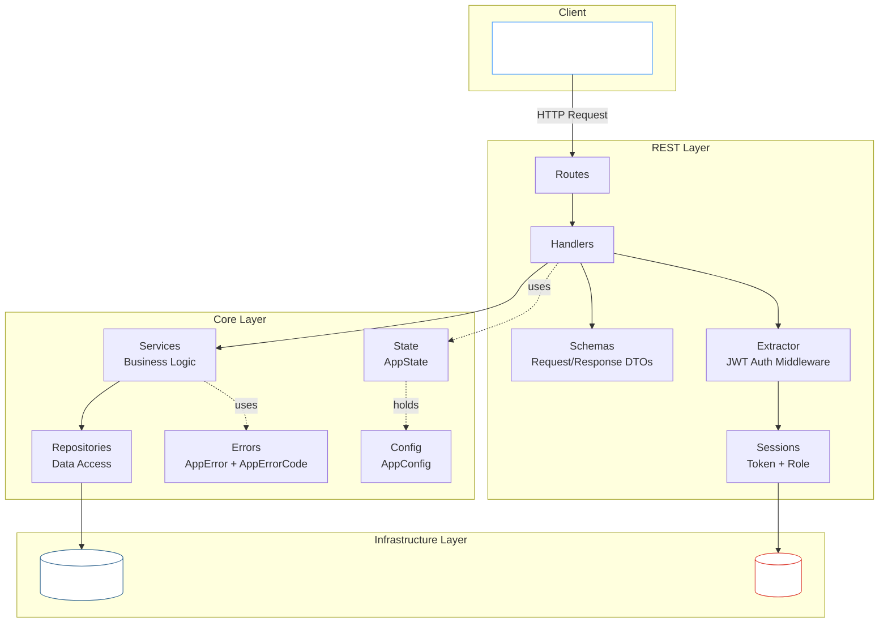
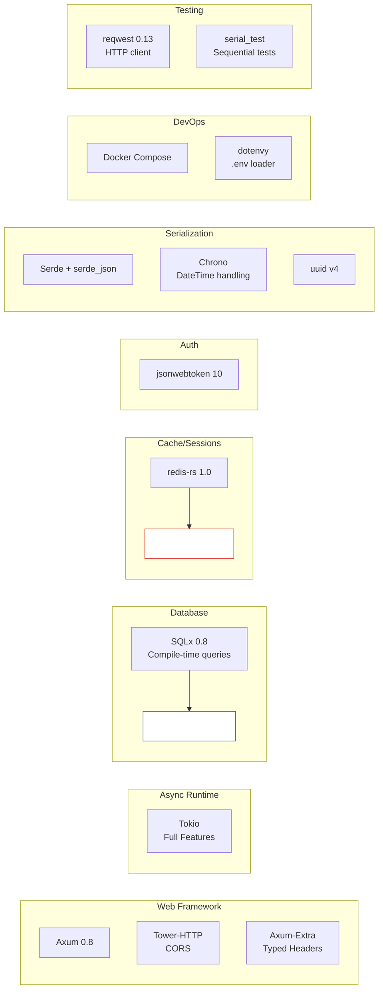
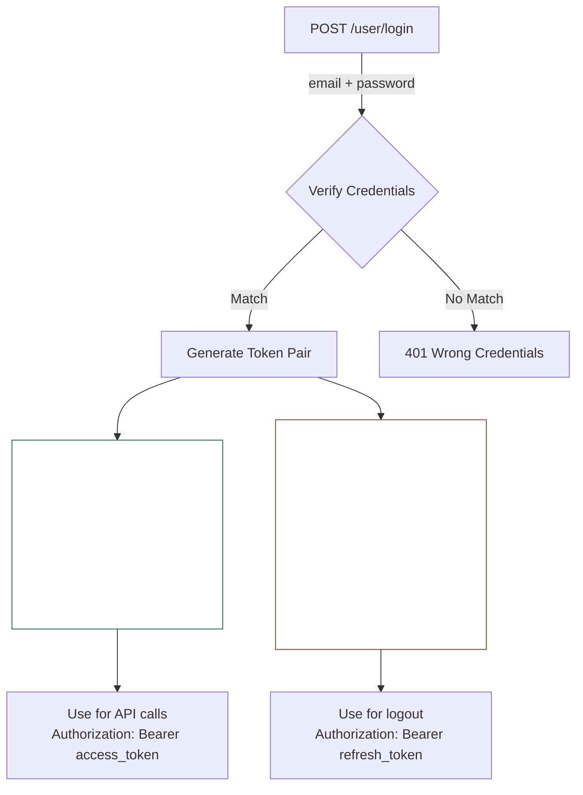

Anda dapat menemukan kode lengkap untuk proyek ini di GitHub: [github.com/frchandra/rusty-todoish](https://github.com/frchandra/rusty-todoish).

## Fitur

| Kemampuan                     | Deskripsi                                                                 |
|-------------------------------|---------------------------------------------------------------------------|
| **CRUD pada Notes**           | Create, Read, Update, Delete note todo dengan pagination                 |
| **JWT Authentication**        | Pasangan Access + Refresh token, ditandatangani dengan HS256              |
| **Role-Based Access Control** | Tiga role: `admin`, `common`, `guest` — masing-masing dengan izin berbeda |
| **Token Revocation**          | Revocation global, per-user, dan per-token yang disimpan di Redis         |
| **Database Transactions**     | Operasi multi-step atomik melalui transaksi SQLx                          |
| **Graceful Shutdown**         | Menangani `SIGTERM` dan `Ctrl+C` dengan bersih                            |
| **CORS Middleware**           | Penanganan cross-origin request yang dapat dikonfigurasi                 |
| **Integration Testing**       | Test end-to-end lengkap menggunakan `reqwest` terhadap server live        |

---

## Gambaran Arsitektur

Proyek ini mengikuti **arsitektur berlapis** yang memisahkan concerns secara bersih. Setiap layer hanya berkomunikasi dengan layer yang langsung di bawahnya — handlers tidak pernah menyentuh database, dan repositories tidak pernah tahu tentang HTTP.



---

## Technology Stack



---

## Struktur Proyek

- `src/`: Source code untuk proyek
    - `app` : Berisi logika aplikasi inti, termasuk services dan use cases.
    - `infra/`: Berisi kode terkait infrastruktur, seperti interaksi database dan setup web server.
    - `models/`: Berisi data models dan DTOs (Data Transfer Objects) yang digunakan di seluruh aplikasi.
    - `domain/`: Berisi logika bisnis inti dan entitas aplikasi.
        - `postgres/`: Berisi kode terkait interaksi database PostgreSQL, termasuk migrations dan implementasi repository.
    - `rest/`: Berisi kode terkait REST API, termasuk route handlers, manajemen sessions, dan models request/response.
    - `main.rs`: Entry point aplikasi, tempat web server diinisialisasi dan routes didefinisikan.
    - `lib.rs`: Entry point untuk library, yang dapat digunakan untuk testing atau sebagai module di proyek lain.
- `tests/`: Berisi integration tests untuk aplikasi, memastikan semua komponen bekerja bersama seperti yang diharapkan.

---

## Deep-Dive Fitur

### Authentication: JWT Access + Refresh Tokens

Sistem authentication menggunakan **strategi dual-token**:



- **Access Token** (`typ: 0`): Berumur pendek (default 1 jam), digunakan untuk semua request API.
- **Refresh Token** (`typ: 1`): Berumur panjang (default 90 hari), berisi referensi balik (`prf`) ke access token pasangannya. Hanya digunakan untuk logout.

Kedua token diekstrak dari header `Authorization: Bearer <token>` menggunakan sistem extractor kustom Axum (`FromRequestParts`).

### Token Revocation (Tiga Layer)

Sistem ini mendukung tiga strategi revocation independen, semua didukung oleh Redis:

| Strategi             | Redis Key                       | Efek                                                       | Siapa yang Bisa Memicu            |
|----------------------|---------------------------------|------------------------------------------------------------|-----------------------------------|
| **Global Revoke**    | `jwt.revoke.global.before`      | Membatalkan *semua* token yang diterbitkan sebelum timestamp | Hanya Admin (`POST /revoke-all`)  |
| **Per-User Revoke**  | `jwt.revoke.user.before` (hash) | Membatalkan semua token untuk user tertentu                 | System / Admin                    |
| **Per-Token Revoke** | `jwt.revoked.tokens` (hash)     | Membatalkan pasangan token tertentu berdasarkan JTI         | User via logout (`POST /user/logout`) |

Pada setiap request, extractor memeriksa ketiga layer sebelum memberikan akses.

### Database Transactions

Endpoint `add_then_update_note` mendemonstrasikan transaksi SQLx:

```rust
// Disederhanakan dari notes_services.rs
let mut tx = app_state.db_pool.begin().await?;

let note = create_note(&mut *tx, title, content, is_published).await?;
let updated = update_note_by_id(&mut *tx, note.id, ...).await?;

tx.commit().await?;  // Atomik! Keduanya berhasil atau keduanya rollback.
```

Fungsi repository menerima generic `Executor<Database = Postgres>`, sehingga mereka bekerja sama baiknya dengan koneksi pool mentah atau transaction handle — tanpa duplikasi kode.

---

## Referensi API Endpoints

### Health Check

| Method | Path | Auth | Deskripsi                        |
|--------|------|------|----------------------------------|
| `GET`  | `/`  | None | Mengembalikan nama dan versi layanan |

**Response:**

```json
{
  "service_name": "rusty-todoish",
  "service_version": "0.1.0"
}
```

### Authentication

| Method | Path           | Auth                 | Deskripsi                           |
|--------|----------------|----------------------|-------------------------------------|
| `POST` | `/user/login`  | None                 | Authenticate dan menerima token pair |
| `POST` | `/user/logout` | Refresh Token        | Revoke token pair                   |
| `POST` | `/revoke-all`  | Access Token (Admin) | Revoke semua token secara global    |

**Login Request:**

```json
{
  "email": "admin@example.com",
  "password": "admin_password"
}
```

**Login Response:**

```json
{
  "access_token": "eyJhbGciOiJIUzI1NiIs...",
  "refresh_token": "eyJhbGciOiJIUzI1NiIs...",
  "token_type": "Bearer"
}
```

### Notes

| Method   | Path                     | Auth         | Role Required | Deskripsi                            |
|----------|--------------------------|--------------|---------------|--------------------------------------|
| `GET`    | `/notes?page=1&limit=10` | Access Token | admin, common | List notes (paginated)               |
| `GET`    | `/notes/{id}`            | Access Token | admin, common | Dapatkan satu note                   |
| `POST`   | `/notes`                 | Access Token | admin         | Buat note baru                       |
| `PUT`    | `/notes/{id}`            | Access Token | admin         | Update note                          |
| `DELETE` | `/notes/{id}`            | None         | —             | Hapus note                           |
| `POST`   | `/notes/add-then-update` | None         | —             | Create + update dalam satu transaksi |

**Create Note Request:**

```json
{
  "title": "Buy groceries",
  "content": "Milk, eggs, bread",
  "is_published": true
}
```

**Note Response:**

```json
{
  "id": "a1b2c3d4-e5f6-7890-abcd-ef1234567890",
  "title": "Buy groceries",
  "content": "Milk, eggs, bread",
  "is_published": true,
  "created_at": "2026-03-15T10:30:00Z",
  "updated_at": "2026-03-15T10:30:00Z"
}
```

**Update Note Request** (semua field opsional):

```json
{
  "title": "Buy groceries (updated)",
  "content": "Milk, eggs, bread, cheese",
  "is_published": false
}
```

---

## Error Handling

Setiap error dalam sistem mengalir melalui satu tipe `AppError` yang memetakan ke struktur JSON yang konsisten:

```json
{
  "code": 401,
  "error": "authentication_wrong_credentials",
  "details": "wrong credentials"
}
```

Enum `AppErrorCode` mencakup 17 kasus error yang berbeda, masing-masing dengan kode numerik bergaya HTTP dan mapping otomatis ke status HTTP yang benar:

| Error Code                         | Numerik | HTTP Status               |
|------------------------------------|---------|---------------------------|
| `InternalServerError`              | 500     | 500 Internal Server Error |
| `AuthenticationWrongCredentials`   | 401     | 401 Unauthorized          |
| `AuthenticationMissingCredentials` | 401     | 401 Unauthorized          |
| `AuthenticationForbidden`          | 403     | 403 Forbidden             |
| `ResourceNotFound`                 | 404     | 404 Not Found             |
| `DatabaseError`                    | 503     | 503 Service Unavailable   |
| `RedisError`                       | 503     | 503 Service Unavailable   |

Error SQLx dan Redis secara otomatis dikonversi ke `AppError` melalui trait `From` Rust.

---

## Cara Menjalankan

### Prasyarat

- [Rust](https://rustup.rs/) (edisi 2024)
- [Docker](https://www.docker.com/) dan Docker Compose
- [SQLx CLI](https://crates.io/crates/sqlx-cli) (`cargo install sqlx-cli`)

### 1. Clone dan Konfigurasi

```bash
git clone https://github.com/frchandra/rusty-todoish.git
cd rusty-todoish

# Copy contoh env dan sesuaikan nilai jika diperlukan
cp .env.example .env
```

### 2. Mulai Infrastructure

```bash
docker compose up -d
```

Ini menjalankan dua container:

| Service    | Image            | Default Port |
|------------|------------------|--------------|
| PostgreSQL | `postgres:16`    | `5432`       |
| Redis      | `redis:7-alpine` | `6379`       |

### 3. Jalankan Database Migrations

```bash
sqlx migrate run --source ./src/infra/postgres/migrations
```

Ini membuat tabel `notes` dan `users` beserta indexes dan triggers mereka.

> [!TIP]
> Untuk reset database, revert semua migrations terlebih dahulu:
> ```bash
> sqlx migrate revert --target-version 0 --source ./src/infra/postgres/migrations
> sqlx migrate run --source ./src/infra/postgres/migrations
> ```

### 4. Mulai Server

```bash
cargo run
```

Server akan bind ke alamat yang ditentukan di `.env` (default `127.0.0.1:8080`). Anda akan melihat:

```
Starting server...
Database connection verified
Connected to redis
```

---

## Testing

### Menjalankan Tests

```bash
# Pastikan Docker containers berjalan dan migrations sudah diaplikasikan
cargo test -- --test-threads=1
```

> [!IMPORTANT]
> Tests ditandai dengan `#[serial]` dan harus berjalan secara berurutan karena mereka berbagi database dan server port yang sama.

### Yang Dicakup Tests

| Test                        | Yang Diverifikasi                                               |
|-----------------------------|-----------------------------------------------------------------|
| `health_check_test`         | Server boot dan mengembalikan metadata layanan                  |
| `list_notes_test`           | Listing authenticated dengan pagination                         |
| `get_note_by_id_test`       | Fetch satu note berdasarkan UUID                                |
| `create_note_test`          | Admin bisa create; regular user ditolak (RBAC)                  |
| `update_note_by_id_test`    | Admin creates → updates → verifikasi perubahan                  |
| `delete_note_by_id_test`    | Hapus note, konfirmasi 404 saat retry, konfirmasi hilang dari list |
| `add_then_update_note_test` | Transaksi database: create + update secara atomik              |
| `login_user_test`           | Login sukses mengembalikan token pair                           |
| `logout_user_test`          | Alur lengkap: no-token → login → access → logout → access denied |

---

## Keputusan Design Kunci

1. **Axum daripada Actix-Web**: Axum terintegrasi secara native dengan Tokio dan Tower, memberikan akses ke ekosistem middleware yang kaya. Pola extractor membuat dependency injection elegant dan type-safe.

2. **SQLx daripada Diesel**: SQLx menyediakan query SQL yang diverifikasi pada compile-time tanpa ORM code-generation. Fungsi repository menerima generic `Executor` trait bounds, membuatnya dapat digunakan kembali dengan koneksi pool dan transaksi.

3. **Redis untuk Sessions, bukan PostgreSQL**: Token revocation membutuhkan key-value lookups yang cepat. Redis menyediakan akses O(1) dan expiry otomatis — cocok secara alami untuk data mirip session.

4. **`AppError` sebagai single error type**: Setiap error dalam sistem dikonversi ke `AppError` melalui trait `From`. Ini berarti handlers dapat menggunakan `?` dengan bebas dan error secara otomatis menjadi response JSON dengan kode status HTTP yang sesuai.

5. **Integration tests daripada unit tests**: Test suite mem-boot server nyata dan membuat request HTTP nyata. Ini menangkap bug integrasi yang terlewat oleh unit tests, dengan biaya perlu Docker berjalan selama testing.

---
