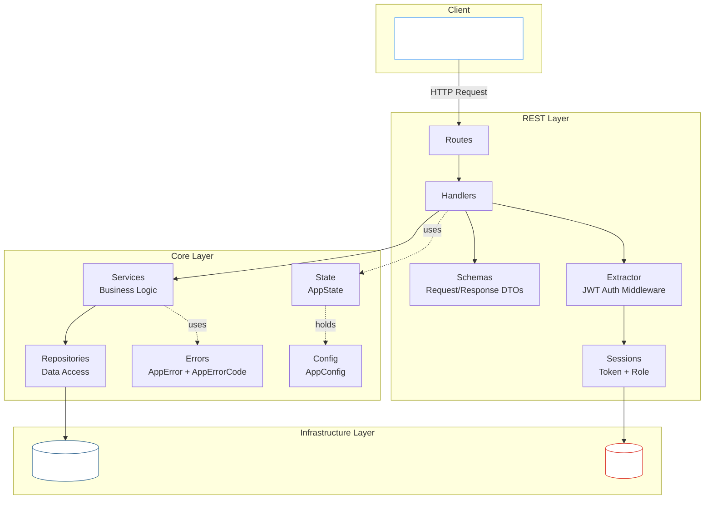
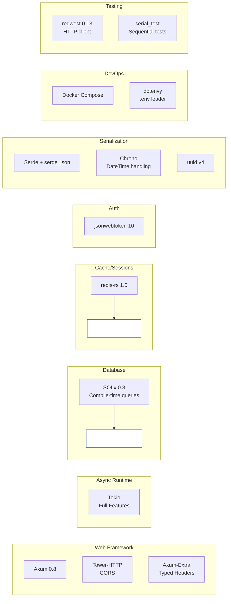
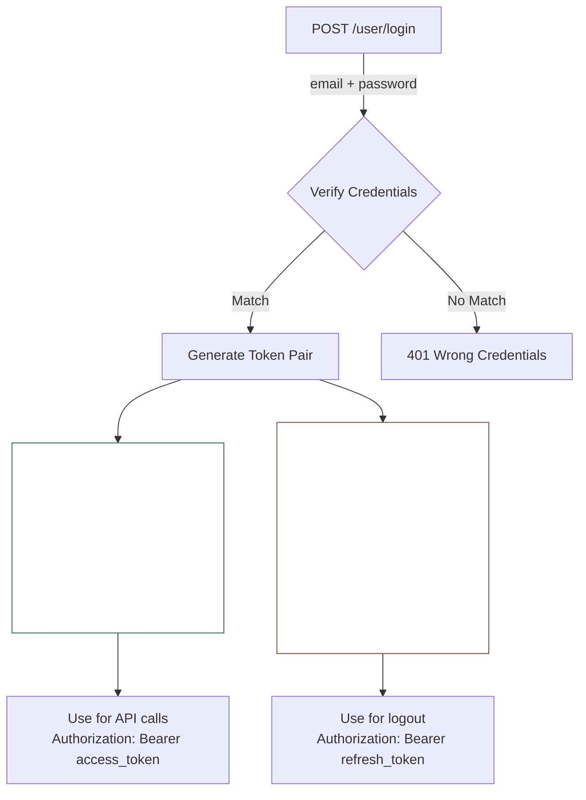

このプロジェクトの完全なコードはGitHubで確認できます：[github.com/frchandra/rusty-todoish](https://github.com/frchandra/rusty-todoish)。

## 機能

| 機能                          | 説明                                                              |
|-------------------------------|-------------------------------------------------------------------|
| **Notesに対するCRUD**         | ページネーション付きのtodoノートの作成、読み取り、更新、削除       |
| **JWT認証**                   | HS256で署名されたAccess + Refreshトークンのペア                    |
| **ロールベースアクセス制御**   | 3つのロール：`admin`、`common`、`guest` — それぞれ異なる権限を持つ |
| **トークン失効**               | Redisに保存されるグローバル、ユーザー別、トークン別の失効         |
| **データベーストランザクション** | SQLxトランザクションによるアトミックなマルチステップ操作          |
| **グレースフルシャットダウン** | `SIGTERM`と`Ctrl+C`をクリーンに処理                              |
| **CORSミドルウェア**           | 設定可能なクロスオリジンリクエスト処理                             |
| **統合テスト**                 | ライブサーバーに対する`reqwest`を使用した完全なエンドツーエンドテスト |

---

## アーキテクチャ概要

このプロジェクトは、関心事をクリーンに分離する**レイヤードアーキテクチャ**に従っています。各レイヤーは直下のレイヤーとのみ通信します — ハンドラーはデータベースに触れず、リポジトリはHTTPについて知りません。



---

## テクノロジースタック



---

## プロジェクト構造

- `src/`: プロジェクトのソースコード
    - `app` : サービスとユースケースを含む、コアアプリケーションロジックを含む。
    - `infra/`: データベース操作やWebサーバーのセットアップなど、インフラストラクチャ関連のコードを含む。
    - `models/`: アプリケーション全体で使用されるデータモデルとDTO（データ転送オブジェクト）を含む。
    - `domain/`: アプリケーションのコアビジネスロジックとエンティティを含む。
        - `postgres/`: マイグレーションやリポジトリ実装を含む、PostgreSQLデータベース操作関連のコードを含む。
    - `rest/`: ルートハンドラー、セッション管理、リクエスト/レスポンスモデルを含む、REST API関連のコードを含む。
    - `main.rs`: Webサーバーが初期化され、ルートが定義される、アプリケーションのエントリーポイント。
    - `lib.rs`: テストや他のプロジェクトのモジュールとして使用できる、ライブラリのエントリーポイント。
- `tests/`: すべてのコンポーネントが期待通りに連携することを確保する、アプリケーションの統合テストを含む。

---

## 機能の詳細解説

### 認証：JWT Access + Refresh トークン

認証システムは**デュアルトークン戦略**を使用します：



- **Access Token** (`typ: 0`): 短命（デフォルト1時間）、すべてのAPIリクエストに使用。
- **Refresh Token** (`typ: 1`): 長命（デフォルト90日）、ペアのアクセストークンへの逆参照（`prf`）を含む。ログアウトにのみ使用。

両方のトークンは、Axumのカスタムエクストラクターシステム（`FromRequestParts`）を使用して`Authorization: Bearer <token>`ヘッダーから抽出されます。

### トークン失効（3つのレイヤー）

このシステムは、すべてRedisによってサポートされる3つの独立した失効戦略をサポートしています：

| 戦略                 | Redis Key                       | 効果                                               | トリガー可能な人                  |
|----------------------|---------------------------------|----------------------------------------------------|-----------------------------------|
| **グローバル失効**    | `jwt.revoke.global.before`      | タイムスタンプより前に発行された*すべて*のトークンを無効化 | 管理者のみ（`POST /revoke-all`）  |
| **ユーザー別失効**    | `jwt.revoke.user.before` (hash) | 特定のユーザーのすべてのトークンを無効化             | システム / 管理者                 |
| **トークン別失効**    | `jwt.revoked.tokens` (hash)     | JTIによって特定のトークンペアを無効化                | ユーザーがログアウト経由（`POST /user/logout`） |

すべてのリクエストで、エクストラクターはアクセスを許可する前に3つすべてのレイヤーをチェックします。

### データベーストランザクション

`add_then_update_note`エンドポイントはSQLxトランザクションを実証します：

```rust
// notes_services.rsから簡略化
let mut tx = app_state.db_pool.begin().await?;

let note = create_note(&mut *tx, title, content, is_published).await?;
let updated = update_note_by_id(&mut *tx, note.id, ...).await?;

tx.commit().await?;  // アトミック！両方成功するか両方ロールバック。
```

リポジトリ関数は汎用的な`Executor<Database = Postgres>`を受け入れるため、生のプール接続でもトランザクションハンドルでも同様に機能します — コードの重複はありません。

---

## APIエンドポイントリファレンス

### ヘルスチェック

| Method | Path | Auth | 説明                             |
|--------|------|------|----------------------------------|
| `GET`  | `/`  | None | サービス名とバージョンを返す      |

**Response:**

```json
{
  "service_name": "rusty-todoish",
  "service_version": "0.1.0"
}
```

### 認証

| Method | Path           | Auth                 | 説明                                |
|--------|----------------|----------------------|-------------------------------------|
| `POST` | `/user/login`  | None                 | 認証してトークンペアを受け取る       |
| `POST` | `/user/logout` | Refresh Token        | トークンペアを失効させる             |
| `POST` | `/revoke-all`  | Access Token (Admin) | すべてのトークンをグローバルに失効   |

**Login Request:**

```json
{
  "email": "admin@example.com",
  "password": "admin_password"
}
```

**Login Response:**

```json
{
  "access_token": "eyJhbGciOiJIUzI1NiIs...",
  "refresh_token": "eyJhbGciOiJIUzI1NiIs...",
  "token_type": "Bearer"
}
```

### Notes

| Method   | Path                     | Auth         | Role Required | 説明                                    |
|----------|--------------------------|--------------|---------------|-----------------------------------------|
| `GET`    | `/notes?page=1&limit=10` | Access Token | admin, common | ノートをリスト（ページネーション付き）   |
| `GET`    | `/notes/{id}`            | Access Token | admin, common | 単一のノートを取得                       |
| `POST`   | `/notes`                 | Access Token | admin         | 新しいノートを作成                       |
| `PUT`    | `/notes/{id}`            | Access Token | admin         | ノートを更新                             |
| `DELETE` | `/notes/{id}`            | None         | —             | ノートを削除                             |
| `POST`   | `/notes/add-then-update` | None         | —             | 1つのトランザクションで作成 + 更新       |

**Create Note Request:**

```json
{
  "title": "Buy groceries",
  "content": "Milk, eggs, bread",
  "is_published": true
}
```

**Note Response:**

```json
{
  "id": "a1b2c3d4-e5f6-7890-abcd-ef1234567890",
  "title": "Buy groceries",
  "content": "Milk, eggs, bread",
  "is_published": true,
  "created_at": "2026-03-15T10:30:00Z",
  "updated_at": "2026-03-15T10:30:00Z"
}
```

**Update Note Request** (すべてのフィールドはオプション):

```json
{
  "title": "Buy groceries (updated)",
  "content": "Milk, eggs, bread, cheese",
  "is_published": false
}
```

---

## エラーハンドリング

システム内のすべてのエラーは、一貫したJSON構造にマッピングされる単一の`AppError`タイプを経由します：

```json
{
  "code": 401,
  "error": "authentication_wrong_credentials",
  "details": "wrong credentials"
}
```

`AppErrorCode` enumは17の異なるエラーケースをカバーし、それぞれが数値HTTPスタイルのコードと正しいHTTPステータスへの自動マッピングを持っています：

| エラーコード                       | 数値 | HTTPステータス            |
|------------------------------------|------|---------------------------|
| `InternalServerError`              | 500  | 500 Internal Server Error |
| `AuthenticationWrongCredentials`   | 401  | 401 Unauthorized          |
| `AuthenticationMissingCredentials` | 401  | 401 Unauthorized          |
| `AuthenticationForbidden`          | 403  | 403 Forbidden             |
| `ResourceNotFound`                 | 404  | 404 Not Found             |
| `DatabaseError`                    | 503  | 503 Service Unavailable   |
| `RedisError`                       | 503  | 503 Service Unavailable   |

SQLxとRedisのエラーは、Rustの`From`トレイトを介して自動的に`AppError`に変換されます。

---

## 実行方法

### 前提条件

- [Rust](https://rustup.rs/) (2024エディション)
- [Docker](https://www.docker.com/)とDocker Compose
- [SQLx CLI](https://crates.io/crates/sqlx-cli) (`cargo install sqlx-cli`)

### 1. クローンと設定

```bash
git clone https://github.com/frchandra/rusty-todoish.git
cd rusty-todoish

# サンプルenvをコピーして、必要に応じて値を調整
cp .env.example .env
```

### 2. インフラストラクチャを起動

```bash
docker compose up -d
```

これにより2つのコンテナが起動します：

| サービス   | イメージ         | デフォルトポート |
|------------|------------------|------------------|
| PostgreSQL | `postgres:16`    | `5432`           |
| Redis      | `redis:7-alpine` | `6379`           |

### 3. データベースマイグレーションを実行

```bash
sqlx migrate run --source ./src/infra/postgres/migrations
```

これにより、`notes`と`users`テーブル、およびそれらのインデックスとトリガーが作成されます。

> [!TIP]
> データベースをリセットするには、まずすべてのマイグレーションを元に戻します：
> ```bash
> sqlx migrate revert --target-version 0 --source ./src/infra/postgres/migrations
> sqlx migrate run --source ./src/infra/postgres/migrations
> ```

### 4. サーバーを起動

```bash
cargo run
```

サーバーは`.env`で指定されたアドレスにバインドされます（デフォルト`127.0.0.1:8080`）。次のように表示されます：

```
Starting server...
Database connection verified
Connected to redis
```

---

## テスト

### テストの実行

```bash
# Dockerコンテナが実行中でマイグレーションが適用されていることを確認
cargo test -- --test-threads=1
```

> [!IMPORTANT]
> テストは`#[serial]`でマークされており、同じデータベースとサーバーポートを共有するため、順次実行する必要があります。

### テストがカバーする内容

| テスト                      | 検証内容                                                         |
|-----------------------------|------------------------------------------------------------------|
| `health_check_test`         | サーバーが起動し、サービスメタデータを返す                       |
| `list_notes_test`           | ページネーション付きの認証済みリスト                             |
| `get_note_by_id_test`       | UUIDによる単一ノートの取得                                       |
| `create_note_test`          | 管理者は作成可能、通常ユーザーは拒否（RBAC）                     |
| `update_note_by_id_test`    | 管理者が作成 → 更新 → 変更を検証                                |
| `delete_note_by_id_test`    | ノートを削除、再試行時に404を確認、リストから消えたことを確認    |
| `add_then_update_note_test` | データベーストランザクション：作成 + 更新をアトミックに          |
| `login_user_test`           | ログイン成功でトークンペアを返す                                 |
| `logout_user_test`          | 完全なフロー：トークンなし → ログイン → アクセス → ログアウト → アクセス拒否 |

---

## 主要な設計決定

1. **Actix-WebよりもAxum**: Axumはネイティブにtokioとtowerと統合し、豊富なミドルウェアエコシステムへのアクセスを提供します。エクストラクターパターンは依存性注入をエレガントかつタイプセーフにします。

2. **DieselよりもSQLx**: SQLxはコード生成ORMなしでコンパイル時に検証されたSQLクエリを提供します。リポジトリ関数は汎用的な`Executor`トレイト境界を受け入れ、プール接続とトランザクションの両方で再利用可能にします。

3. **PostgreSQLではなくRedisをセッションに**: トークン失効には高速なキーバリュールックアップが必要です。RedisはO(1)アクセスと自動有効期限を提供 — セッションのようなデータに自然に適合します。

4. **単一エラータイプとしての`AppError`**: システム内のすべてのエラーは`From`トレイトを介して`AppError`に変換されます。これは、ハンドラーが自由に`?`を使用でき、エラーが適切なHTTPステータスコードを持つJSON応答に自動的になることを意味します。

5. **ユニットテストよりも統合テスト**: テストスイートは実際のサーバーを起動し、実際のHTTPリクエストを作成します。これにより、ユニットテストが見逃す統合バグをキャッチしますが、テスト中にDockerを実行する必要があるというコストがかかります。

---
